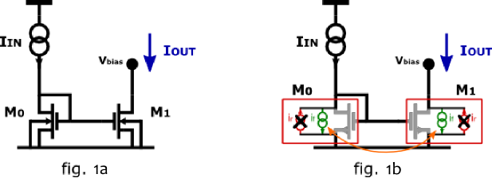
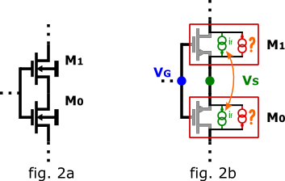
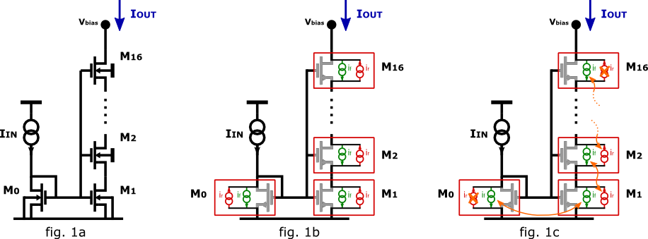

OP example
~~~~~~~~~~

Introduction
""""""""""""

This page shows the operating point simulation of some circuits.

A simple 1:1 current mirror
"""""""""""""""""""""""""""

A 1:1 current mirror (fig. 1a) is employed to provide a copy of an input
current to a load. The two currents being resp. :math:`I_{IN}` and
:math:`I_{OUT}`. A good current mirror complies with a
mirroring ratio - equal to one here - has a low input resistance - it's
a good current sink - and a high output resistance - it's a good current
source or equi.v it's a low dependence of :math:`I_{out}` on the output 
voltage. Please remember, "good" is a qualifier that is only meaningful
in relation to the rest of the circuit where the mirror is employed.

According to the EKV model, the drain currents of M0 and M1 are composed
by two components: the forward current (:math:`i_f`) and the reverse 
current (:math:`i_r`), see fig. 1b. The former is a function of the 
pinch-off voltage and the source voltage, referred to the bulk voltage.
The latter is a function of the pinch-off voltage and the drain voltage,
again referred to the bulk voltage. [Channel-length modulation is neglected]

The short between gate and drain of M0 ensures that there can't be
channel at the drain side of M0. The reverse current is hence null. For
the correct operation of the mirror (ie :math:`I_{OUT}` equal to
:math:`I_{IN}`), the channel has to be pinched off on the drain side of M1 
as well, because otherwise the output voltage would control the output
current.

Since M0 and M1 share gate node, source node and bulk node, their
forward currents (:math:`i_f`) are equal. In addition each of them has
a null reverse current.

The total drain current of an MOS transistor is according to the EKV
model:

.. math::

    I_d = I_s (i_f - i_r)

Where :math:`I_s` is known as specific current and it is a scaling
factor, in particular it is proportional to the W/L ratio of the device.

In this example and in the following, all devices are matched
(ie equally dimensioned).

Therefore:

.. math::

    I_{OUT} = I_{IN}

If M1 had a form factor :math:`k` times bigger than M0, then :math:`I_{s1}`
would have been proportionally bigger than :math:`I_{s0}` and:

.. math::

    I_{OUT} = k \cdot I_{IN}

Netlist
^^^^^^^

::

    * 1-to-1 current mirror 
    m0 inc inc 0 0 nch w=10u l=3u
    m1 out inc 0 0 nch w=10u l=3u

    i1 0 inc type=idc idc=16u

    v1 out 0 type=vdc vdc=2.5

    .model ekv nch TYPE=n VTO=.4 KP=400e-6

    .op

Simulation results
^^^^^^^^^^^^^^^^^^

::

    * 1-TO-1 CURRENT MIRROR
    Starting op analysis:
    Calculating guess: done.
    Solving with Gmin:
    Building Gmin matrix...
    Solving...  done.
    Solving without Gmin:
    Solving...  done.
    Difference check is within margins.
    (Voltage: er=0.001, ea=1e-06, Current: er=0.001, ea=1e-09)
    Solution without Gmin:
    Vinc:       0.661166520045  V  
    Vout:                  2.5  V  
    I(V1):  -1.64022400455e-05  A  
    OP INFORMATION:
    M0        N ch  MODERATE INVERSION                      SATURATION                                                                                
    beta  [A/V^2]:   0.000666997062349  Weff  [m]:       1e-05 (1e-05)   Leff      [m]:  2.9985139559e-06 (3e-06)  M/N:                          1/1  
    Vdb       [V]:      0.661166520045   Vgb  [V]:      0.661166520045    Vsb      [V]:                       0.0    Vp      [V]:     0.117435542925  
    VTH       [V]:                 0.4   VOD  [V]:      0.182380106934   nq:                        1.57402376913    VA      [V]:       55.926133036  
    Ids       [A]:   1.59999948649e-05  nv:              1.55302306603  Ispec      [A]:         2.80523480148e-06  TEF:               0.340129035153  
    gmg       [S]:   0.000135363138199   gms  [S]:  -0.000210508167477    rob    [Ohm]:             3495384.43658                                     
    if:                   5.7034387414   ir:          0.00264346735244     Qf  [C/m^2]:         0.000110516787925    Qr  [C/m^2]:  1.50198071064e-07  
    -------------------
    M1        N ch  MODERATE INVERSION                      SATURATION                                                                                 
    beta  [A/V^2]:   0.000683757860402  Weff  [m]:       1e-05 (1e-05)   Leff      [m]:  2.92501207785e-06 (3e-06)  M/N:                          1/1  
    Vdb       [V]:                 2.5   Vgb  [V]:      0.661166520045    Vsb      [V]:                        0.0    Vp      [V]:     0.117435542925  
    VTH       [V]:                 0.4   VOD  [V]:      0.182380106934   nq:                         1.57402376913    VA      [V]:      58.7233705568  
    Ids       [A]:   1.64022352838e-05  nv:              1.55302306603  Ispec      [A]:          2.80523480148e-06  TEF:                0.33178787657  
    gmg       [S]:   0.000135367502575   gms  [S]:  -0.000210508167477    rob    [Ohm]:              3580205.35254                                     
    if:                   5.7034387414   ir:           0.0025806785066     Qf  [C/m^2]:          0.000110516787925    Qr  [C/m^2]:  1.46639633291e-07  
    -------------------
    TOTAL POWER: 5.15842644346e-05 W

Notice how the two transistors have the same :math:`i_f` and a low 
:math:`i_r` (saturation). Channel length modulation (due to different 
drain voltages) explains for the discrepancy in :math:`I_{DS}` 

A different view of the 1:1 current mirror
""""""""""""""""""""""""""""""""""""""""""

Consider now the two transistors in fig. 2a.

The circuit is similar to the one in fig. 1a: the two transistors again
share gate, source and bulk nodes (potential) and have a separate drain
node, but this time the KCL at the source node is different: the node is
not set to a fixed potential.

Nonetheless, a similar discussion can be drawn: considering fig. 2b, the
forward and reverse current components have been put in evidence.

Notice how source and drain of M0 appear to have been switched around:
MOS transistors are geometrically symmetrical, the choice of drain and
source labeling has no influence on the results. On the other hand, the
choice made in fig 2b allows us to state that again M0 and M1 have the
same forward current.

Notice how the two devices can't be both in saturation: on the side on
which they share the source node, if one transistor has a channel, the
other needs to have one has well. In addition, at least one of the
reverse currents has to be non-zero, since the total current entering
the drain of M1 (Itot) has to flow out of M0 as well, or a net non-zero
charge would be created at every instant.

Therefore both transistors can't be in saturation.

The results are: 

* M0: :math:`i_f`, :math:`i_r = I_{TOT} + i_f`

* M1: :math:`i_f`, :math:`i_r = I_{TOT} - i_f`

The rest of the circuit - not shown - would set the actual value of
:math:`i_f` and :math:`I_{TOT}`.

A 1:1/16th current mirror 
"""""""""""""""""""""""""

A down-scaling current mirror is depicted in fig. 3a.

Here again, the transistors share the same bulk and gate node, and,
two-by-two, they also share drain/source node.

While this circuit is more complex than the previous ones, it can be
analyzed in the same fashion, taking into account the results already
presented: 

- each neighboring transistor pair acts like a current mirror, ie same :math:`i_f`/:math:`i_r`,
- zero net charge can be created or destroyed at each instant.

Considering the currents, we have 17 forward currents and 17 reverse
currents to be determined, for a total of 34 unknowns:

We can write:

* 15 equations of the type :math:`i_f = i_r` for neighboring devices,

* 1 equation for the mirror operation of the M0-M1 pair,

* 1 equation setting :math:`i_r = 0` for M0 (drain-gate short),

* 1 equation setting :math:`I_s \cdot i_f = I_{IN}` for M0 (KCL),

* 1 equation setting :math:`i_r = 0` for M16 (hp. in saturation),

* 15 equations to require that M1, M2, M3... M16 have all
    the same drain current.

That gives a total of 34 equations.

It can be shown that the solution is: 

- M0: :math:`i_f = I_{IN}/I_s`, :math:`i_r = 0`

- M1: :math:`i_f = I_{IN}/I_s`, :math:`i_r = 15/16 \cdot I_{IN}/I_s` 

- M2: :math:`i_f = 15/16 I_{IN}/I_s`, :math:`i_r = 14/16 \cdot I_{IN}/I_s`

- and so on...

The general form is:

M[n], for :math:`n = 1 \dots 16`, :math:`i_f = (17 - n)/16 \cdot I_{IN}/I_s` and
:math:`i_r = (16-n)/16 \cdot I_{IN}/I_s`.

M16 has :math:`i_f = 1/16 \cdot I_{IN}/I_s` and :math:`i_r = 0`. 
Its drain current - the mirror output current - is therefore:

.. math::

    I_{OUT} = 1/16 \cdot I_{IN}.

Netlist 
^^^^^^^

::

    * 1-to-1/16th down-scaling current mirror 

    m0 inc inc 0 0 nch w=1u l=1u

    m16 out inc n1 0  nch w=1u l=1u
    m15 n1 inc n2 0 nch w=1u l=1u 
    m14 n2 inc n3 0 nch w=1u l=1u 
    m13 n3 inc n4 0 nch w=1u l=1u 
    m12 n4 inc n5 0 nch w=1u l=1u 
    m11 n5 inc n6 0 nch w=1u l=1u 
    m10 n6 inc n7 0 nch w=1u l=1u 
    m9 n7 inc n8 0 nch w=1u l=1u 
    m8 n8 inc n9 0 nch w=1u l=1u 
    m7 n9 inc n10 0 nch w=1u l=1u 
    m6 n10 inc n11 0 nch w=1u l=1u 
    m5 n11 inc n12 0 nch w=1u l=1u 
    m4 n12 inc n13 0 nch w=1u l=1u 
    m3 n13 inc n14 0 nch w=1u l=1u 
    m2 n14 inc n15 0 nch w=1u l=1u 
    m1 n15 inc 0 0 nch w=1u l=1u 

    i1 0 inc type=idc idc=16e-6
    v1 out 0 type=vdc vdc=5

    .model ekv nch TYPE=n VTO=.4 KP=400e-6

    .op

Simulation results
^^^^^^^^^^^^^^^^^^

::

    * 1-TO-1/16TH DOWN-SCALING CURRENT MIRROR
    Starting op analysis:
    Calculating guess: done.
    Solving with Gmin:
    Building Gmin matrix...
    Solving...  done.
    Solving without Gmin:
    Solving...  done.
    Difference check is within margins.
    (Voltage: er=0.001, ea=1e-06, Current: er=0.001, ea=1e-09)
    Solution without Gmin:
    Vinc:      0.904813615968  V  
    Vout:                 5.0  V  
    Vn1:       0.222041524366  V  
    Vn2:       0.183949114562  V  
    Vn3:       0.158276458021  V  
    Vn4:       0.137871535291  V  
    Vn5:       0.120520118975  V  
    Vn6:       0.105208756242  V  
    Vn7:      0.0913779977097  V  
    Vn8:      0.0786820153752  V  
    Vn9:       0.066890054189  V  
    Vn10:     0.0558393890315  V  
    Vn11:     0.0454103544576  V  
    Vn12:     0.0355120049651  V  
    Vn13:     0.0260733625457  V  
    Vn14:     0.0170378079838  V  
    Vn15:     0.0083593406432  V  
    I(V1):  -1.0327588469e-06  A  
    OP INFORMATION:
    M0        N ch   STRONG INVERSION                      SATURATION                                                                                 
    beta  [A/V^2]:  0.000193555471162  Weff  [m]:       1e-06 (1e-06)   Leff      [m]:  1.03329551368e-06 (1e-06)  M/N:                          1/1  
    Vdb       [V]:     0.904813615968   Vgb  [V]:      0.904813615968    Vsb      [V]:                        0.0    Vp      [V]:      0.24383362138  
    VTH       [V]:                0.4   VOD  [V]:      0.369325572375   nq:                         1.55151340493    VA      [V]:       2.3850844813  
    Ids       [A]:  1.59999863615e-05  nv:              1.51466221222  Ispec      [A]:          8.29535007765e-07  TEF:                0.20843499948  
    gmg       [S]:    8.073972779e-05   gms  [S]:  -0.000129001766756    rob    [Ohm]:              149067.907148                                     
    if:                 20.1828675005   ir:             0.25276934725     Qf  [C/m^2]:          0.000225753091822    Qr  [C/m^2]:  1.17396160816e-05  
    -------------------
    M16       N ch  MODERATE INVERSION                      SATURATION                                                                                
    beta  [A/V^2]:   0.000236055431981  Weff  [m]:       1e-06 (1e-06)   Leff      [m]:  8.47258621932e-07 (1e-06)  M/N:                         1/1  
    Vdb       [V]:                 5.0   Vgb  [V]:      0.904813615968    Vsb      [V]:             0.222041524366    Vp      [V]:     0.24383362138  
    VTH       [V]:                 0.4   VOD  [V]:     0.0330076658728   nq:                         1.55151340493    VA      [V]:     45.7896511174  
    Ids       [A]:   1.03275797244e-06  nv:              1.51466221222  Ispec      [A]:          8.29535007765e-07  TEF:              0.516148397578  
    gmg       [S]:    1.3598388406e-05   gms  [S]:  -2.06195194629e-05    rob    [Ohm]:              44337252.6182                                    
    if:                  1.05552698204   ir:         0.000703390112833     Qf  [C/m^2]:            3.608415906e-05    Qr  [C/m^2]:  3.9470194852e-08  
    -------------------
    M15       N ch  MODERATE INVERSION                         LINEAR                                                                                 
    beta  [A/V^2]:   0.000196221608214  Weff  [m]:      1e-06 (1e-06)   Leff      [m]:  1.01925573753e-06 (1e-06)  M/N:                          1/1  
    Vdb       [V]:      0.222041524366   Vgb  [V]:     0.904813615968    Vsb      [V]:             0.183949114562    Vp      [V]:      0.24383362138  
    VTH       [V]:                 0.4   VOD  [V]:    0.0907047995749   nq:                         1.55151340493    VA      [V]:    0.0497875842199  
    Ids       [A]:   1.03275775078e-06  nv:             1.51466221222  Ispec      [A]:          8.29535007765e-07  TEF:               0.889383922345  
    gmg       [S]:   9.76227671625e-06   gms  [S]:  -3.5529830659e-05    rob    [Ohm]:              48208.3859281                                     
    if:                  2.33331263359   ir:             1.0643556238     Qf  [C/m^2]:          6.21772036532e-05    Qr  [C/m^2]:  3.63007382702e-05  
    -------------------
    M14       N ch  MODERATE INVERSION                          LINEAR                                                                                
    beta  [A/V^2]:   0.000197175919967  Weff  [m]:       1e-06 (1e-06)   Leff      [m]:  1.0143226416e-06 (1e-06)  M/N:                          1/1  
    Vdb       [V]:      0.183949114562   Vgb  [V]:      0.904813615968    Vsb      [V]:            0.158276458021    Vp      [V]:      0.24383362138  
    VTH       [V]:                 0.4   VOD  [V]:      0.129590202326   nq:                        1.55151340493    VA      [V]:    0.0289727041979  
    Ids       [A]:   1.03275801302e-06  nv:              1.51466221222  Ispec      [A]:         8.29535007765e-07  TEF:                1.17601518018  
    gmg       [S]:   7.48320262966e-06   gms  [S]:  -4.69804206758e-05    rob    [Ohm]:             28053.7200705                                     
    if:                  3.60776881968   ir:             2.34495311438     Qf  [C/m^2]:         8.22157361826e-05    Qr  [C/m^2]:  6.23803187459e-05  
    -------------------
    M13       N ch  MODERATE INVERSION                          LINEAR                                                                                 
    beta  [A/V^2]:   0.000197622982017  Weff  [m]:       1e-06 (1e-06)   Leff      [m]:  1.01202804431e-06 (1e-06)  M/N:                          1/1  
    Vdb       [V]:      0.158276458021   Vgb  [V]:      0.904813615968    Vsb      [V]:             0.137871535291    Vp      [V]:      0.24383362138  
    VTH       [V]:                 0.4   VOD  [V]:      0.160496767728   nq:                         1.55151340493    VA      [V]:    0.0219308104837  
    Ids       [A]:   1.03275814052e-06  nv:              1.51466221222  Ispec      [A]:          8.29535007765e-07  TEF:                1.41788921504  
    gmg       [S]:   6.30593158677e-06   gms  [S]:  -5.66430103458e-05    rob    [Ohm]:              21235.1852997                                     
    if:                   4.8813573262   ir:             3.62139820283     Qf  [C/m^2]:          9.91252681051e-05    Qr  [C/m^2]:  8.24103946022e-05  
    -------------------
    M12       N ch  MODERATE INVERSION                          LINEAR                                                                                
    beta  [A/V^2]:   0.000197890926494  Weff  [m]:       1e-06 (1e-06)   Leff      [m]:  1.0106577575e-06 (1e-06)  M/N:                          1/1  
    Vdb       [V]:      0.137871535291   Vgb  [V]:      0.904813615968    Vsb      [V]:            0.120520118975    Vp      [V]:      0.24383362138  
    VTH       [V]:                 0.4   VOD  [V]:       0.18677830235   nq:                        1.55151340493    VA      [V]:    0.0181981374178  
    Ids       [A]:   1.03275822015e-06  nv:              1.51466221222  Ispec      [A]:         8.29535007765e-07  TEF:                1.63116706912  
    gmg       [S]:    5.5540108543e-06   gms  [S]:  -6.51632153734e-05    rob    [Ohm]:             17620.9078396                                     
    if:                  6.15483579078   ir:             4.89658255608     Qf  [C/m^2]:         0.000114035626904    Qr  [C/m^2]:  9.93138387607e-05  
    -------------------
    M11       N ch  MODERATE INVERSION                          LINEAR                                                                                 
    beta  [A/V^2]:   0.000198073131348  Weff  [m]:       1e-06 (1e-06)   Leff      [m]:  1.00972806679e-06 (1e-06)  M/N:                          1/1  
    Vdb       [V]:      0.120520118975   Vgb  [V]:      0.904813615968    Vsb      [V]:             0.105208756242    Vp      [V]:      0.24383362138  
    VTH       [V]:                 0.4   VOD  [V]:        0.2099698449   nq:                         1.55151340493    VA      [V]:    0.0158233129666  
    Ids       [A]:   1.03275827611e-06  nv:              1.51466221222  Ispec      [A]:          8.29535007765e-07  TEF:                1.82412667895  
    gmg       [S]:   5.01998756573e-06   gms  [S]:  -7.28717299041e-05    rob    [Ohm]:              15321.4099879                                     
    if:                  7.42849392389   ir:             6.17139807159     Qf  [C/m^2]:          0.000127525527332    Qr  [C/m^2]:  0.000114219252757  
    -------------------
    M10       N ch  MODERATE INVERSION                          LINEAR                                                                                 
    beta  [A/V^2]:   0.000198206852699  Weff  [m]:       1e-06 (1e-06)   Leff      [m]:  1.00904684816e-06 (1e-06)  M/N:                          1/1  
    Vdb       [V]:      0.105208756242   Vgb  [V]:      0.904813615968    Vsb      [V]:            0.0913779977097    Vp      [V]:      0.24383362138  
    VTH       [V]:                 0.4   VOD  [V]:      0.230918772215   nq:                         1.55151340493    VA      [V]:    0.0141523755851  
    Ids       [A]:   1.03275831829e-06  nv:              1.51466221222  Ispec      [A]:          8.29535007765e-07  TEF:                2.00168302606  
    gmg       [S]:   4.61535219563e-06   gms  [S]:  -7.99649018188e-05    rob    [Ohm]:              13703.4728595                                     
    if:                  8.70245034288   ir:             7.44620254594     Qf  [C/m^2]:          0.000139938578183    Qr  [C/m^2]:  0.000127704853941  
    -------------------
    M9        N ch  MODERATE INVERSION                          LINEAR                                                                                
    beta  [A/V^2]:   0.000198310138598  Weff  [m]:       1e-06 (1e-06)   Leff      [m]:  1.00852130614e-06 (1e-06)  M/N:                         1/1  
    Vdb       [V]:     0.0913779977097   Vgb  [V]:      0.904813615968    Vsb      [V]:            0.0786820153752    Vp      [V]:     0.24383362138  
    VTH       [V]:                 0.4   VOD  [V]:      0.250148896904   nq:                         1.55151340493    VA      [V]:   0.0128989737018  
    Ids       [A]:   1.03275835162e-06  nv:              1.51466221222  Ispec      [A]:          8.29535007765e-07  TEF:               2.16703802962  
    gmg       [S]:   4.29500867285e-06   gms  [S]:  -8.65706441092e-05    rob    [Ohm]:              12489.8275396                                    
    if:                  9.97675042417   ir:             8.72115687844     Qf  [C/m^2]:          0.000151498627191    Qr  [C/m^2]:  0.00014011402435  
    -------------------
    M8        N ch   STRONG INVERSION                          LINEAR                                                                                 
    beta  [A/V^2]:  0.000198392895287  Weff  [m]:       1e-06 (1e-06)   Leff      [m]:  1.00810061626e-06 (1e-06)  M/N:                          1/1  
    Vdb       [V]:    0.0786820153752   Vgb  [V]:      0.904813615968    Vsb      [V]:             0.066890054189    Vp      [V]:      0.24383362138  
    VTH       [V]:                0.4   VOD  [V]:      0.268009734921   nq:                         1.55151340493    VA      [V]:    0.0119161419552  
    Ids       [A]:  1.03275837884e-06  nv:              1.51466221222  Ispec      [A]:          8.29535007765e-07  TEF:                2.32241587635  
    gmg       [S]:  4.03321312301e-06   gms  [S]:  -9.27778104751e-05    rob    [Ohm]:              11538.1702045                                     
    if:                 11.2514053587   ir:             9.99633553235     Qf  [C/m^2]:          0.000162361168332    Qr  [C/m^2]:  0.000151670496187  
    -------------------
    M7        N ch   STRONG INVERSION                         LINEAR                                                                                 
    beta  [A/V^2]:   0.00019846105755  Weff  [m]:      1e-06 (1e-06)   Leff      [m]:  1.00775437997e-06 (1e-06)  M/N:                          1/1  
    Vdb       [V]:     0.066890054189   Vgb  [V]:     0.904813615968    Vsb      [V]:            0.0558393890315    Vp      [V]:      0.24383362138  
    VTH       [V]:                0.4   VOD  [V]:     0.284747759855   nq:                         1.55151340493    VA      [V]:    0.0111199812787  
    Ids       [A]:  1.03275840164e-06  nv:             1.51466221222  Ispec      [A]:          8.29535007765e-07  TEF:                2.46943627226  
    gmg       [S]:  3.81404706427e-06   gms  [S]:  -9.8651106306e-05    rob    [Ohm]:              10767.2629543                                     
    if:                 12.5264097287   ir:            11.2717709335     Qf  [C/m^2]:          0.000172639436036    Qr  [C/m^2]:  0.000162529698349  
    -------------------
    M6        N ch   STRONG INVERSION                          LINEAR                                                                                 
    beta  [A/V^2]:  0.000198518419499  Weff  [m]:       1e-06 (1e-06)   Leff      [m]:  1.00746318908e-06 (1e-06)  M/N:                          1/1  
    Vdb       [V]:    0.0558393890315   Vgb  [V]:      0.904813615968    Vsb      [V]:            0.0454103544576    Vp      [V]:      0.24383362138  
    VTH       [V]:                0.4   VOD  [V]:      0.300544224434   nq:                         1.55151340493    VA      [V]:    0.0104587776192  
    Ids       [A]:   1.0327584211e-06  nv:              1.51466221222  Ispec      [A]:          8.29535007765e-07  TEF:                 2.6093222773  
    gmg       [S]:  3.62706421814e-06   gms  [S]:  -0.000104239391439    rob    [Ohm]:              10127.0320391                                     
    if:                 13.8017500679   ir:             12.5474737773     Qf  [C/m^2]:          0.000182418935017    Qr  [C/m^2]:  0.000172804825071  
    -------------------
    M5        N ch   STRONG INVERSION                          LINEAR                                                                                
    beta  [A/V^2]:  0.000198567531583  Weff  [m]:       1e-06 (1e-06)   Leff      [m]:  1.0072140113e-06 (1e-06)  M/N:                          1/1  
    Vdb       [V]:    0.0454103544576   Vgb  [V]:      0.904813615968    Vsb      [V]:           0.0355120049651    Vp      [V]:      0.24383362138  
    VTH       [V]:                0.4   VOD  [V]:      0.315536880374   nq:                        1.55151340493    VA      [V]:   0.00989875048115  
    Ids       [A]:  1.03275843798e-06  nv:              1.51466221222  Ispec      [A]:         8.29535007765e-07  TEF:                2.74302437776  
    gmg       [S]:   3.4650857034e-06   gms  [S]:  -0.000109580636704    rob    [Ohm]:             9584.76843865                                     
    if:                 15.0774092523   ir:             13.8234431638     Qf  [C/m^2]:         0.000191766114233    Qr  [C/m^2]:  0.000182581354073  
    -------------------
    M4        N ch   STRONG INVERSION                        LINEAR                                                                                 
    beta  [A/V^2]:  0.000198610178219  Weff  [m]:     1e-06 (1e-06)   Leff      [m]:  1.00699773694e-06 (1e-06)  M/N:                          1/1  
    Vdb       [V]:    0.0355120049651   Vgb  [V]:    0.904813615968    Vsb      [V]:            0.0260733625457    Vp      [V]:      0.24383362138  
    VTH       [V]:                0.4   VOD  [V]:    0.329833235381   nq:                         1.55151340493    VA      [V]:   0.00941680636307  
    Ids       [A]:  1.03275845282e-06  nv:            1.51466221222  Ispec      [A]:          8.29535007765e-07  TEF:                 2.8712987005  
    gmg       [S]:  3.32299269557e-06   gms  [S]:  -0.0001147050485    rob    [Ohm]:              9118.11114922                                     
    if:                  16.353368823   ir:           15.0996719747     Qf  [C/m^2]:          0.000200733834875    Qr  [C/m^2]:  0.000191925714807  
    -------------------
    M3        N ch   STRONG INVERSION                          LINEAR                                                                                 
    beta  [A/V^2]:  0.000198647649302  Weff  [m]:       1e-06 (1e-06)   Leff      [m]:  1.00680778606e-06 (1e-06)  M/N:                          1/1  
    Vdb       [V]:    0.0260733625457   Vgb  [V]:      0.904813615968    Vsb      [V]:            0.0170378079838    Vp      [V]:      0.24383362138  
    VTH       [V]:                0.4   VOD  [V]:      0.343519048442   nq:                         1.55151340493    VA      [V]:   0.00899656795571  
    Ids       [A]:  1.03275846598e-06  nv:              1.51466221222  Ispec      [A]:          8.29535007765e-07  TEF:                2.99475852913  
    gmg       [S]:  3.19702338781e-06   gms  [S]:  -0.000119637126799    rob    [Ohm]:              8711.20233049                                     
    if:                 17.6296102286   ir:             16.3761498503     Qf  [C/m^2]:          0.000209364971898    Qr  [C/m^2]:  0.000200890753493  
    -------------------
    M2        N ch   STRONG INVERSION                          LINEAR                                                                                 
    beta  [A/V^2]:  0.000198680902931  Weff  [m]:       1e-06 (1e-06)   Leff      [m]:  1.00663927458e-06 (1e-06)  M/N:                          1/1  
    Vdb       [V]:    0.0170378079838   Vgb  [V]:      0.904813615968    Vsb      [V]:            0.0083593406432    Vp      [V]:      0.24383362138  
    VTH       [V]:                0.4   VOD  [V]:      0.356663994983   nq:                         1.55151340493    VA      [V]:   0.00862606476442  
    Ids       [A]:  1.03275847775e-06  nv:              1.51466221222  Ispec      [A]:          8.29535007765e-07  TEF:                 3.1139094834  
    gmg       [S]:  3.08434271957e-06   gms  [S]:  -0.000124397070523    rob    [Ohm]:              8352.45117837                                     
    if:                 18.9061154837   ir:             17.6528648853     Qf  [C/m^2]:          0.000217694873415    Qr  [C/m^2]:  0.000209519333023  
    -------------------
    M1        N ch   STRONG INVERSION                          LINEAR                                                                                 
    beta  [A/V^2]:  0.000198710667278  Weff  [m]:       1e-06 (1e-06)   Leff      [m]:  1.00648849274e-06 (1e-06)  M/N:                          1/1  
    Vdb       [V]:    0.0083593406432   Vgb  [V]:      0.904813615968    Vsb      [V]:                        0.0    Vp      [V]:      0.24383362138  
    VTH       [V]:                0.4   VOD  [V]:      0.369325572375   nq:                         1.55151340493    VA      [V]:   0.00829632303901  
    Ids       [A]:  1.03275848844e-06  nv:              1.51466221222  Ispec      [A]:          8.29535007765e-07  TEF:                3.22917428061  
    gmg       [S]:  2.98276797184e-06   gms  [S]:  -0.000129001766756    rob    [Ohm]:                8033.168579                                     
    if:                 20.1828675005   ir:             18.9298046103     Qf  [C/m^2]:          0.000225753091822    Qr  [C/m^2]:  0.000217846791436  
    -------------------
    TOTAL POWER: 1.964081209e-05 W

The :math:`I_{OUT}/I_{IN}` scaling factor is as expected,
since :math:`I_{OUT} = 1uA` when :math:`I_{IN} = 16uA`. 
Furthermore, the results regarding the subdivision of the drain
current in :math:`i_f/i_r` and the mirroring of currents in neighboring
devices agree with the expectations as well.

Lastly, notice how only M0 and M16 operate in saturation, all other
transistors are in linear region.
