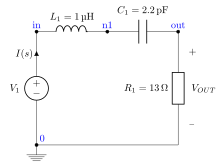
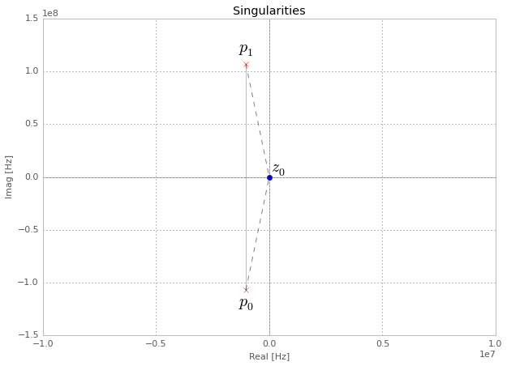
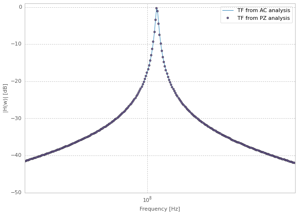
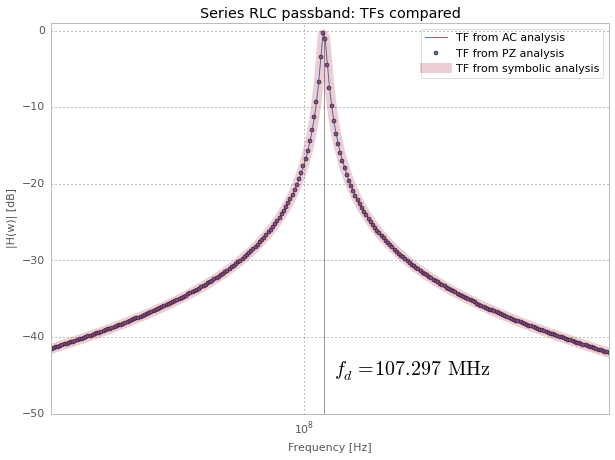

Pole-Zero example
=================

Giuseppe Venturini, Thu May 7, 2015

In this short example we will simulate a simple `RLC
circuit <https://en.wikipedia.org/wiki/RLC_circuit>`__ with the
`ahkab <https://ahkab.github.io/ahkab/>`__ simulator.

In particular, we consider a series resonant RLC circuit. If you need to
refresh your knowledge on 2nd filters, you may `take a look at this
page <http://hyperphysics.phy-astr.gsu.edu/hbase/electric/serres.html>`__.

The plan: what we'll do
-----------------------

0. A brief analysis of the circuit
~~~~~~~~~~~~~~~~~~~~~~~~~~~~~~~~~~

This should be done with pen and paper, we'll just mention the results.
The circuit is pretty simple, feel free to skip if you find it boring.

1. How to describe the circuit with ahkab
~~~~~~~~~~~~~~~~~~~~~~~~~~~~~~~~~~~~~~~~~

We'll show this:

-  from Python,
-  and briefly with a netlist deck.

2. Pole-zero analysis
~~~~~~~~~~~~~~~~~~~~~

-  We will extract poles and zeros.
-  We'll use them to build input-output transfer function, which we
   evaluate.

3. AC analysis
~~~~~~~~~~~~~~

-  We will run an AC analysis to evaluate numerically the transfer
   function.

4. Symbolic analysis
~~~~~~~~~~~~~~~~~~~~

-  We'll finally run a symbolic analysis as well.
-  Once we have the results, we'll substitute for the real circuit
   values and verify both AC and PZ analysis.

5. Conclusions
~~~~~~~~~~~~~~

We will check that the three PZ, AC and Symbolic analysis match!

The circuit
-----------

The circuit we simulate is a very simple one:

0. Theory
---------

Once one proves that the current flowing in the only circuit branch in
the Laplace domain is given by:

.. math:: I(s) = \frac{1}{L}\cdot\frac{s}{s^2 + 2\alpha\cdot s + \omega_0^2}

Where:

-  :math:`s` is the Laplace variable, :math:`s = \sigma + j \omega`:

   -  :math:`j` is the imaginary unit,
   -  :math:`\omega` is the angular frequency (units rad/s).

-  :math:`\alpha` is known as the *Neper frequency* and it is given by
   :math:`R/(2L)`,
-  :math:`\omega_0` is the \*(undamped) resonance frequency, equal to
   :math:`(\sqrt{LC})^{-1}`.

It's easy to show that the pass-band transfer function we consider in
our circuit, :math:`V_{OUT}/V_{IN}`, has the expression:

.. math:: H(s) = \frac{V_{OUT}}{V_{IN}}(s) = k_0 \cdot\frac{s}{s^2 + 2\alpha\cdot s + \omega_0^2}

Where the coeffiecient :math:`k_0` has value :math:`k_0 = R/L`.

Solving for poles and zeros, we get:

-  One zero:

   -  :math:`z_0`, located in the origin.

-  Two poles, :math:`p_0` and :math:`p_1`:

   -  :math:`p_{0,1} = - \alpha \pm \sqrt{\alpha^2 - \omega_0^2}`

1. Describe the circuit with ahkab
----------------------------------

Let's call ``ahkab`` and describe the circuit above.

First we need to import ``ahkab``:

.. code-block:: python

    # libraries we need
    import ahkab

.. raw:: html

   <!-- a html comment -->

::

    Populating the interactive namespace from numpy and matplotlib

.. raw:: html

   <!-- a html comment -->

.. code-block:: python

    print "We're using ahkab %s" % ahkab.__version__

.. raw:: html

   <!-- a html comment -->

::

    We're using ahkab 0.16

Then we create a new circuit object titled 'RLC bandpass', which we name
``bpf`` from Band-Pass Filter:

.. code-block:: python

    bpf = ahkab.Circuit('RLC bandpass')

A circuit is made of, internally, components and nodes. For now, our
``bpf`` circuit is empty and really of not much use.

We wish to define our nodes, our components, specifying their connection
to the appropriate nodes and inform the circuit instance about the what
we did.

It sounds complicated, but it is actually very simple, also thanks to
the convenience functions ``add_*()`` in the ``Circuit`` instances
(`circuit
documentation <https://ahkab.readthedocs.org/en/latest/circuit.html>`__).

We now add the inductor ``L1``, the capacitor ``C1``, the resistor
``R1`` and the input source ``V1``:

.. code-block:: python

    bpf = ahkab.Circuit('RLC bandpass')
    bpf.add_inductor('L1', 'in', 'n1', 1e-6)
    bpf.add_capacitor('C1', 'n1', 'out', 2.2e-12)
    bpf.add_resistor('R1', 'out', bpf.gnd, 13)
    # we also give V1 an AC value since we wish to run an AC simulation
    # in the following
    bpf.add_vsource('V1', 'in', bpf.gnd, dc_value=1, ac_value=1)

Notice that:

-  the nodes to which they get connected (``'in'``, ``'n1'``,
   ``'out'``...) are nothing but strings. If you prefer handles, you can
   call the ``create_node()`` method of the circuit instance ``bpf``
   (`create\_node
   documentation <https://ahkab.readthedocs.org/en/latest/circuit.html#ahkab.circuit.Circuit.create_node>`__).
-  Using the convenience methods ``add_*``, the nodes are not explicitly
   added to the circuit, but they are in fact automatically taken care
   of behind the hood.

Now we have successfully defined our circuit object ``bpf``.

Let's see what's in there and generate a netlist:

.. code-block:: python

    print(bpf)

.. raw:: html

   <!-- a html comment -->

::

    * RLC bandpass
    L1 in n1 1e-06
    C1 n1 out 2.2e-12
    R1 out 0 13
    V1 in 0 type=vdc value=1 vac=1 

The above text defines the same circuit in netlist form. It has the
advantage that it's a very concise piece of text and that the syntax
resembles (not perfectly yet) that of simulators such as
`SPICE <https://newton.ex.ac.uk/teaching/CDHW/Electronics2/userguide/>`__.

If you prefer to run ``ahkab`` from the command line, be sure to check
the `Netlist syntax doc
page <https://ahkab.readthedocs.org/en/latest/help/Netlist-Syntax.html>`__
and to add the simulation statements, which are missing above.

2. PZ analysis
--------------

The analysis is set up easily by calling ``ahkab.new_pz()``. Its
signature is:

.. code-block:: python

    ahkab.new_pz(input_source=None, output_port=None, shift=0.0, MNA=None,
                 outfile=None, x0=u'op', verbose=0)

And you can find `the documentation for ahkab.new\_pz
here <https://ahkab.readthedocs.org/en/latest/ahkab.html#ahkab.ahkab.new_pz>`__.

We will set:

-  Input source and output port, to enable the extraction of the zeros.

   -  the input source is ``V1``,
   -  the output port is defined between the output node ``out`` and
      ground node (``bpf.gnd``).

-  We need no linearisation, since the circuit is linear. Therefore we
   set ``x0`` to ``None``.
-  I inserted a non-zero shift in the initial calculation frequency
   below. You may want to fiddle a bit with this value, the algorithm
   internally tries to kick the working frequency away from the exact
   location of the zeros, since we expect a zero in the origin, we help
   the simulation find the zero quickly by shifting away the initial
   working point.

.. raw:: html

   <!-- a html comment -->

.. code-block:: python

    pza = ahkab.new_pz('V1', ('out', bpf.gnd), x0=None, shift=1e3)
    r = ahkab.run(bpf, pza)['pz']

The results are in the ``pz_solution`` object ``r``. It has an interface
that works like a dictionary.

Eg. you can do:

.. code-block:: python

    r.keys()

.. raw:: html

   <!-- a html comment -->

.. code-block:: python

    [u'p0', u'p1', u'z0']

Check out the `documentation on pz\_solution for
more <https://ahkab.readthedocs.org/en/latest/results.html#ahkab.results.pz_solution>`__.

Let's see what we got:

.. code-block:: python
   :emphasize-lines: 2,3

    print('Singularities:')
    for x, _ in r:
        print "* %s = %+g %+gj Hz" % (x, np.real(r[x]), np.imag(r[x]))

.. raw:: html

   <!-- a html comment -->

::

    Singularities:
    * p0 = -1.03451e+06 -1.07297e+08j Hz
    * p1 = -1.03451e+06 +1.07297e+08j Hz
    * z0 = -1.44751e-13 +0j Hz

**Note that the results are frequencies expressed in Hz** (and *not*
angular frequencies in rad/s).

Graphically, we can see better where the singularities are located:

.. code-block:: python

    figure(figsize=figsize)
    # plot o's for zeros and x's for poles
    for x, v in r:
        plot(np.real(v), np.imag(v), 'bo'*(x[0]=='z')+'rx'*(x[0]=='p'))
    # set axis limits and print some thin axes
    xm = 1e6
    xlim(-xm*10., xm*10.)
    plot(xlim(), [0,0], 'k', alpha=.5, lw=.5)
    plot([0,0], ylim(), 'k', alpha=.5, lw=.5)
    # plot the distance from the origin of p0 and p1
    plot([np.real(r['p0']), 0], [np.imag(r['p0']), 0], 'k--', alpha=.5)
    plot([np.real(r['p1']), 0], [np.imag(r['p1']), 0], 'k--', alpha=.5)
    # print the distance between p0 and p1
    plot([np.real(r['p1']), np.real(r['p0'])],
         [np.imag(r['p1']), np.imag(r['p0'])],
         'k-', alpha=.5, lw=.5)
    # label the singularities
    text(np.real(r['p1']), np.imag(r['p1'])*1.1, '$p_1$', ha='center',
         fontsize=20)
    text(.4e6, .4e7, '$z_0$', ha='center', fontsize=20)
    text(np.real(r['p0']), np.imag(r['p0'])*1.2, '$p_0$', ha='center',
         va='bottom', fontsize=20)
    xlabel('Real [Hz]'); ylabel('Imag [Hz]'); title('Singularities');

As expected, we got two complex conjugate poles and a zero in the
origin.

**The resonance frequency**

Let's check that indeed the (undamped) resonance frequency :math:`f_0`
has the expected value from the theory.

It should be:

.. math:: f_0 = \frac{1}{2\pi\sqrt{LC}}

Since we have little damping, :math:`f_0` is very close to the damped
resonant frequency in our circuit, given by the absolute value of the
imaginary part of either :math:`p_0` or :math:`p_1`.

In fact, the damped resonant frequency :math:`f_d` is given by:

.. math:: f_d = \frac{1}{2\pi}\sqrt{\alpha^2 -w_0^2}

Since this is an example and we have Python at our fingertips, we'll
compensate for the frequency pulling due to the damping anyway. That
way, the example is analytically correct.

::

    C = 2.2e-12
    L = 1e-6
    f0 = 1./(2*np.pi*np.sqrt(L*C))
    print 'Resonance frequency from analytic calculations: %g Hz' %f0

.. raw:: html

   <!-- a html comment -->

::

    Resonance frequency from analytic calculations: 1.07302e+08 Hz

.. raw:: html

   <!-- a html comment -->

::

    alpha = (-r['p0']-r['p1'])/2
    a1 = np.real(abs(r['p0'] - r['p1']))/2
    f0 = np.sqrt(a1**2 - alpha**2)
    f0 = np.real_if_close(f0)
    print 'Resonance frequency from PZ analysis: %g Hz' %f0

.. raw:: html

   <!-- a html comment -->

::

    Resonance frequency from PZ analysis: 1.07292e+08 Hz

That's alright.

3. AC analysis
--------------

Let's perform an AC analysis:

::

    aca = ahkab.new_ac(start=1e8, stop=5e9, points=5e2, x0=None)
    rac = ahkab.run(bpf, aca)['ac']

Next, we use sympy to assemble the transfer functions from the
singularities we got from the PZ analysis.

::

    import sympy
    sympy.init_printing()

.. raw:: html

   <!-- a html comment -->

::

    from sympy.abc import w
    from sympy import I
    p0, p1, z0 = sympy.symbols('p0, p1, z0')
    k = 13/1e-6 # constant term, can be calculated to be R/L
    H = 13/1e-6*(I*w + z0*6.28)/(I*w +p0*6.28)/(I*w + p1*6.28)
    Hl = sympy.lambdify(w, H.subs({p0:r['p0'], z0:abs(r['z0']), p1:r['p1']}))

We need a function to evaluate the absolute value of a transfer function
in decibels.

Here it is:

::

    def dB20(x):
        return 20*np.log10(x)

Next we can plot :math:`|H(\omega)|` in dB and inspect the results
visually.

::

    figure(figsize=figsize)
    semilogx(rac.get_x()/2/np.pi, dB20(abs(rac['vout'])),
             label='TF from AC analysis')
    semilogx(rac.get_x()/2/np.pi, dB20(abs(Hl(rac.get_x()))), 'o', ms=4,
             label='TF from PZ analysis')
    legend(); xlabel('Frequency [Hz]'); ylabel('|H(w)| [dB]');
    xlim(4e7, 3e8); ylim(-50, 1);

4. Symbolic analysis
--------------------

Next, we setup and run a symbolic analysis.

We set the input source to be ``'V1'``, in this way, ``ahkab`` will
calculate all transfer functions, together with low-frequency gain,
poles and zeros, with respect to *every* variable in the circuit.

It is done very similarly to the previous cases:

::

    symba = ahkab.new_symbolic(source='V1')
    rs, tfs = ahkab.run(bpf, symba)['symbolic']

Notice how to the ``'symbolic'`` key corresponds a tuple of two objects:
the symbolic results and the TF object that was derived from it.

Let's inspect their contents:

::

    print(rs)

.. raw:: html

   <!-- a html comment -->

::

    Symbolic simulation results for 'RLC bandpass' (netlist None).
    Run on 2015-05-07 04:24:42.
    I[L1]    = C1*V1*s/(C1*L1*s**2 + C1*R1*s + 1.0)
    I[V1]    = -C1*V1*s/(C1*L1*s**2 + C1*R1*s + 1.0)
    VIN  = V1
    VN1  = V1*(C1*R1*s + 1.0)/(C1*L1*s**2 + C1*R1*s + 1.0)
    VOUT     = C1*R1*V1*s/(C1*L1*s**2 + C1*R1*s + 1.0)

.. raw:: html

   <!-- a html comment -->

::

    print tfs

.. raw:: html

   <!-- a html comment -->

::

    Symbolic transfer function results for 'RLC bandpass' (netlist None).
    Run on 2015-05-07 04:24:42.
    I[L1]/V1:
        gain:   C1*s/(C1*L1*s**2 + C1*R1*s + 1.0)
        gain0:  0
        poles:
            0.5*(-C1*R1 + sqrt(C1*(C1*R1**2 - 4.0*L1)))/(C1*L1)
            -0.5*(C1*R1 + sqrt(C1*(C1*R1**2 - 4.0*L1)))/(C1*L1)
        zeros:
            0
    I[V1]/V1:
        gain:   -C1*s/(C1*L1*s**2 + C1*R1*s + 1.0)
        gain0:  0
        poles:
            0.5*(-C1*R1 + sqrt(C1*(C1*R1**2 - 4.0*L1)))/(C1*L1)
            -0.5*(C1*R1 + sqrt(C1*(C1*R1**2 - 4.0*L1)))/(C1*L1)
        zeros:
            0
    VIN/V1:
        gain:   1
    VN1/V1:
        gain:   (C1*R1*s + 1.0)/(C1*L1*s**2 + C1*R1*s + 1.0)
        gain0:  1.00000000000000
        poles:
            0.5*(-C1*R1 + sqrt(C1*(C1*R1**2 - 4.0*L1)))/(C1*L1)
            -0.5*(C1*R1 + sqrt(C1*(C1*R1**2 - 4.0*L1)))/(C1*L1)
        zeros:
            -1/(C1*R1)
    VOUT/V1:
        gain:   C1*R1*s/(C1*L1*s**2 + C1*R1*s + 1.0)
        gain0:  0
        poles:
            0.5*(-C1*R1 + sqrt(C1*(C1*R1**2 - 4.0*L1)))/(C1*L1)
            -0.5*(C1*R1 + sqrt(C1*(C1*R1**2 - 4.0*L1)))/(C1*L1)
        zeros:
            0

In particular, to our transfer function corresponds:

::

    tfs['VOUT/V1']

.. raw:: html

   <!-- a html comment -->

::

    {u'gain': C1*R1*s/(C1*L1*s**2 + C1*R1*s + 1.0),
     u'gain0': 0,
     u'poles': [0.5*(-C1*R1 + sqrt(C1*(C1*R1**2 - 4.0*L1)))/(C1*L1),
      -0.5*(C1*R1 + sqrt(C1*(C1*R1**2 - 4.0*L1)))/(C1*L1)],
     u'zeros': [0]}

It's easy to show the above entries are a different formulation that
corresponds to the theoretical results we introduced at the beginning of
this example.

We'll do it graphically. First of all, let's isolate out TF:

::

    Hs = tfs['VOUT/V1']['gain']
    Hs

.. math:: \frac{C_{1} R_{1} s}{C_{1} L_{1} s^{2} + C_{1} R_{1} s + 1.0}

We wish to substitute the correct circuit values to ``R1``, ``L1`` and
``C1`` to be able to evaluate numerically the results.

In order to do so, the ``symbolic_solution`` class in the ``results``
module has a method named ``as_symbols`` that takes a string of
space-separed symbol names and returns the ``sympy`` symbols associated
with them (`symbolic\_solution.as\_symbols
documentation <https://ahkab.readthedocs.org/en/latest/results.html#ahkab.results.symbolic_solution.as_symbols>`__).

::

    s, C1, R1, L1 = rs.as_symbols('s C1 R1 L1')
    HS = sympy.lambdify(w, Hs.subs({s:I*w, C1:2.2e-12, R1:13., L1:1e-6}))

Did we get the same results, let's sat within a 1dB accuracy?

::

    np.allclose(dB20(abs(HS(rac.get_x()))), dB20(abs(Hl(rac.get_x()))), atol=1)

.. raw:: html

   <!-- a html comment -->

::

    True

Good.

5. Conclusions
--------------

Let's take a look at PZ, AC and symbolic results together:

::

    figure(figsize=figsize);  title('Series RLC passband: TFs compared')
    semilogx(rac.get_x()/2/np.pi, dB20(abs(rac['vout'])),
             label='TF from AC analysis')
    semilogx(rac.get_x()/2/np.pi, dB20(abs(Hl(rac.get_x()))), 'o', ms=4,
             label='TF from PZ analysis')
    semilogx(rac.get_x()/2/np.pi, dB20(abs(HS(rac.get_x()))), '-', lw=10,
             alpha=.2, label='TF from symbolic analysis')
    vlines(1.07297e+08, *gca().get_ylim(), alpha=.4)
    text(7e8/2/np.pi, -45, '$f_d = 107.297\\, \\mathrm{MHz}$', fontsize=20)
    legend(); xlabel('Frequency [Hz]'); ylabel('|H(w)| [dB]');
    xlim(4e7, 3e8); ylim(-50, 1);

I hope this example helped show how to use
`ahkab <https://ahkab.github.io/ahkab/>`__ and in particular how to
perform PZ, AC and symbolic analysis. If it also cleared up some doubts,
great!

Please remember this is an experimental simulator and you may find
bug... it's getting better but we're not really ready for prime time
yet: please report any and all bugs you may encounter on `the issue
tracker <https://github.com/ahkab/ahkab/issues>`__.

This document was written with Jupiter running with a Python kernel (project
formerly named IPython). You can find it here: `Jupyter/IPython
<https://jupyter.org/>`__ and you may `access the whole notebook
<http://nbviewer.ipython.org/github/ahkab/ahkab/blob/master/doc/examples/PZ_Example.ipynb>`__,
which will allow you to download and modify this example.

Have fun!
