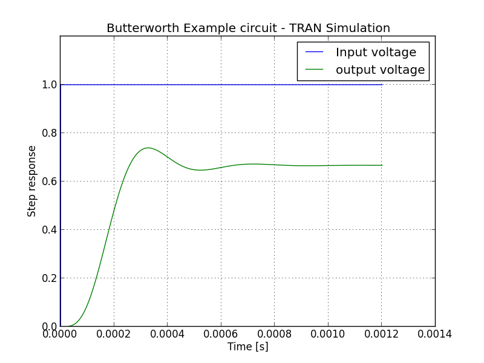
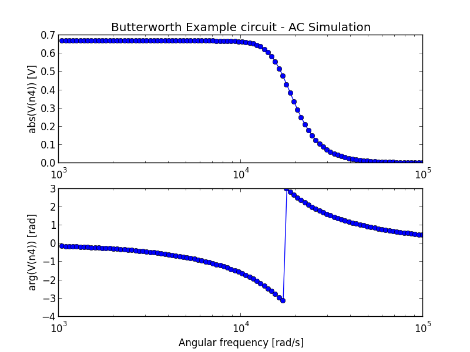

Python API
~~~~~~~~~~

*Simulating The Python Way*: interacting with ahkab inside a Python
program gives the user the ability to employ the extreme flexibility and
power of Python.

This page gives an (incomplete) example to show how. More can
be found in :mod:`ahkab` and :mod:`ahkab.circuit`.

Example
"""""""

Let's say we would like to simulate the AC characteristics and the step
response of a Butterworth low pass filter, such as this:

.. image:: ../images/python_api/example_circuit.jpg

This example is example 7.4 in from Hercules G. Dimopoulos, *Analog
Electronic Filters: Theory, Design and Synthesis*, Springer.

The code to describe the circuit is the following:

First import the modules and create a new circuit:

.. code:: python

    import ahkab
    from ahkab import circuit, printing, devices
        
    mycircuit = circuit.Circuit(title="Butterworth Example circuit")

Elements are to be connected to *nodes*. There is one special node, the
reference (gnd):

.. code:: python

    import ahkab
    from ahkab import circuit, printing, devices
    mycircuit = circuit.Circuit(title="Butterworth Example circuit")

    gnd = mycircuit.get_ground_node()

and ordinary nodes.

Ordinary nodes can be defined as:

.. code:: python

    # setup
    import ahkab
    from ahkab import circuit, printing, devices
    mycircuit = circuit.Circuit(title="Butterworth Example circuit")
    # now we can define the nodes
    # 1. using arbitrary strings to describe the nodes
    # eg:
    n1 = 'n1'
    # 2. using the alternative syntax:
    n1 = mycircuit.create_node('n1')
    # the helper function create_node() will check that this is not a
    # node name that was used somewhere else in your circuit

Then you can use the nodes you have defined to add your elements to the
circuit. The circuit instance provides convenient helper functions.

You can use any of these styles:

.. code:: python

    # setup, just like before
    import ahkab
    from ahkab import circuit, printing, devices
    mycircuit = circuit.Circuit(title="Butterworth Example circuit")
    # first option: define the new nodes and add to the circuit using 
    # positional arguments
    n1 = mycircuit.create_node("n1")
    n2 = mycircuit.create_node("n2")
    mycircuit.add_resistor("R1", n1, n2, 600.)
    # or add the nodes and the resistor directly to the circuit using keyword args:
    # (better double check the node names in big circuits) 
    mycircuit.add_resistor("R1", n1="n1", n2="n2", value=600) 

Using the second style, the passives in example 7.4 can be added as:

.. code:: python

    import ahkab
    from ahkab import circuit, printing, devices
    mycircuit = circuit.Circuit(title="Butterworth Example circuit")
        
    gnd = mycircuit.get_ground_node()
        
    mycircuit.add_resistor("R1", n1="n1", n2="n2", value=600)
    mycircuit.add_inductor("L1", n1="n2", n2="n3", value=15.24e-3)
    mycircuit.add_capacitor("C1", n1="n3", n2=gnd, value=119.37e-9)
    mycircuit.add_inductor("L2", n1="n3", n2="n4", value=61.86e-3)
    mycircuit.add_capacitor("C2", n1="n4", n2=gnd, value=155.12e-9)
    mycircuit.add_resistor("R2", n1="n4", n2=gnd, value=1.2e3)

Next, we want to add the voltage source V1.

-  First, we define a pulse function to provide the time-variable
   characteristics of V1, to be used in the transient simulation:

.. code:: python

   voltage_step = devices.pulse(v1=0, v2=1, td=500e-9, tr=1e-12, pw=1, tf=1e-12, per=2)

-  Then we add a voltage source named V1 to the circuit, with the
   time-function we have just built:

.. code:: python

   mycircuit.add_vsource("V1", n1="n1", n2=gnd, dc_value=5, ac_value=1, function=voltage_step)

Putting all together:

.. code:: python

    voltage_step = devices.pulse(v1=0, v2=1, td=500e-9, tr=1e-12, pw=1, tf=1e-12, per=2)
    mycircuit.add_vsource("V1", n1="n1", n2=gnd, dc_value=5, ac_value=1, function=voltage_step)

We can now check that the circuit is defined as we intended, generating
a netlist.

.. code:: python

    print mycircuit

If you invoke python now, you should get an output like this:

::

    * TITLE: Butterworth Example circuit
    R1 n1 n2 600
    L1 n2 n3 0.01524
    C1 n3 0 1.1937e-07
    L2 n3 n4 0.06186
    C2 n4 0 1.5512e-07
    R2 n4 0 1200.0
    V1 n1 0 type=vdc vdc=5 vac=1 arg=0 type=pulse v1=0 v2=1 td=5e-07 per=2 tr=1e-12 tf=1e-12 pw=1

Next, we need to define the analyses to be carried out:

.. code:: python

    op_analysis = ahkab.new_op()
    ac_analysis = ahkab.new_ac(start=1e3, stop=1e5, points=100)
    tran_analysis = ahkab.new_tran(tstart=0, tstop=1.2e-3, tstep=1e-6, x0=None)

Next, we run the simulation:

.. code:: python

    r = ahkab.run(mycircuit, an_list=[op_analysis, ac_analysis, tran_analysis])

Save the script to a file and start python in interactive model with:

``python -i script.py``

All results were saved in a variable 'r'. Let's take a look at the OP
results:

.. code:: python

    >>> r
    `{'ac': <results.ac_solution instance at 0xb57e4ec>, 
    'op': <results.op_solution instance at 0xb57e4cc>, 
    'tran': <results.tran_solution instance at 0xb57e4fc>}`

    >>> r['op'].results
    {'VN4': 3.3333333333333335, 'VN3': 3.3333333333333335, 'VN2': 3.3333333333333335, 
    'I(L1)': 0.0027777777777777779, 'I(V1)': -0.0027777777777777779, 'I(L2)': 0.0027777777777777779, 'VN1': 5.0}

You can get all the available variables calling the keys() method:

.. code:: python

    >>> r['op'].keys()
    ['VN1', 'VN2', 'VN3', 'VN4', 'I(L1)', 'I(L2)', 'I(V1)']
    >>> r['op']['VN4']
    3.3333333333333335

Then you can access the data through the dictionary interface, eg:

.. code:: python

    >>> "The DC output voltage is %s %s" % (r['op']['VN4'] , r['op'].units['VN4'])
    'The DC output voltage is 3.33333333333 V'

A similar interface is available for the AC simulation results:

.. code:: python

    >>> print(r['ac'])
    <AC simulation results for Butterworth Example circuit (netlist None). 
    LOG sweep, from 1000 Hz to 100000 Hz, 100 points. Run on 2011-12-19 17:24:29>
    >>> r['ac'].keys()
    ['#w', '|Vn1|', 'arg(Vn1)', '|Vn2|', 'arg(Vn2)', '|Vn3|', 'arg(Vn3)', '|Vn4|', 
    'arg(Vn4)', '|I(L1)|', 'arg(I(L1))', '|I(L2)|', 'arg(I(L2))', '|I(V1)|', 'arg(I(V1))']

And a similar approach can be used to access the TRAN data set.

The data can be plotted through matplotlib, for example:

.. code:: python

        import pylab as plt
        import numpy as np
        
        fig = plt.figure()
        plt.title(mycircuit.title + " - TRAN Simulation")
        plt.plot(r['tran']['T'], r['tran']['VN1'], label="Input voltage")
        plt.hold(True)
        plt.plot(r['tran']['T'], r['tran']['VN4'], label="output voltage")
        plt.legend()
        plt.hold(False)
        plt.grid(True)
        plt.ylim([0,1.2])
        plt.ylabel('Step response')
        plt.xlabel('Time [s]')
        fig.savefig('tran_plot.png')
        
        fig = plt.figure()
        plt.subplot(211)
        plt.semilogx(r['ac']['w'], np.abs(r['ac']['Vn4']), 'o-')
        plt.ylabel('abs(V(n4)) [V]')
        plt.title(mycircuit.title + " - AC Simulation")
        plt.subplot(212)
        plt.grid(True)
        plt.semilogx(r['ac']['w'], np.angle(r['ac']['Vn4']), 'o-')
        plt.xlabel('Angular frequency [rad/s]')
        plt.ylabel('arg(V(n4)) [rad]')
        fig.savefig('ac_plot.png')
        plt.show()

The previous code generates the following plots:

It is also possible to extract attenuation in pass-band (0-2kHz) and
stop-band (6.5kHz and up).

The problem is that the voltages/currents we are looking for may not
have been evaluated by ahkab at the desired points. This can be easily
overcome with interpolation through scipy.

Here is a snippet of code to evaluate the attenuation is pass-band and
stop band in the example:

.. code:: python

         import numpy as np
         import scipy, scipy.interpolate

         # Normalize the output to the low frequency value and convert to array
         norm_out = np.abs(r['ac']['Vn4'])/np.abs(r['ac']['Vn4']).max()
         # Convert to dB
         norm_out_db = 20*np.log10(norm_out)
         # Convert angular frequencies to Hz and convert matrix to array
         frequencies = r['ac']['w']/2/np.pi
         # call scipy to interpolate
         norm_out_db_interpolated = scipy.interpolate.interp1d(frequencies, norm_out_db)

         print "Maximum attenuation in the pass band (0-%g Hz) is %g dB" % \
         (2e3, -1.0*norm_out_db_interpolated(2e3))
         print "Minimum attenuation in the stop band (%g Hz - Inf) is %g dB" % \
         (6.5e3, -1.0*norm_out_db_interpolated(6.5e3))

You should see the following output:

.. code:: python

    Maximum attenuation in the pass band (0-2000 Hz) is 0.351373 dB
    Minimum attenuation in the stop band (6500 Hz - Inf) is 30.2088 dB

`Download the python
file. <https://raw.github.com/wiki/ahkab/ahkab/script.py>`__
