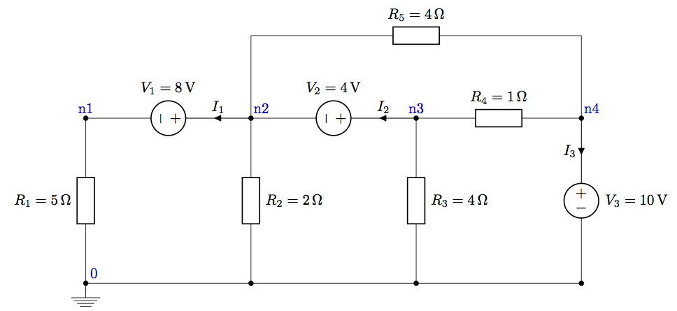

A first OP example
==================

Performing numeric Operating Point (OP) simulations with ``ahkab`` of
linear networks -- like those in undergrad network theory textbooks-- is
really straight-forward.

The circuit
-----------

In this brief text, we will describe the following circuit:

Circuit description
-------------------

First of all, we need the ``ahkab`` library to be imported:

::

    import ahkab

.. raw:: html

   <!--- break --->

Next, we create a new `circuit
object <https://ahkab.readthedocs.org/en/latest/circuit.html#the-circuit>`__.
The only parameter you need is the name, which in the following is
'Simple Example Circuit'.

::

    mycir = ahkab.Circuit('Simple Example Circuit')

Now's time to add the elements. The circuit object we just created
(``mycir``) offers `plenty of convenience
methods <https://ahkab.readthedocs.org/en/latest/circuit.html#the-circuit>`__
to add elements to your circuit instances.

The general structure of the methods signature is:

::

    add_<element_type>(part_id, node1, node2, value)

For example, we have an ``add_resistor`` method, with signature:

::

    add_resistor(part_id, n1, n2, value)

Our circuit is described by:

::

    mycir.add_resistor('R1', 'n1', mycir.gnd, value=5)
    mycir.add_vsource('V1', 'n2', 'n1', dc_value=8)
    mycir.add_resistor('R2', 'n2', mycir.gnd, value=2)
    mycir.add_vsource('V2', 'n3', 'n2', dc_value=4)
    mycir.add_resistor('R3', 'n3', mycir.gnd, value=4)
    mycir.add_resistor('R4', 'n3', 'n4', value=1)
    mycir.add_vsource('V3', 'n4', mycir.gnd, dc_value=10)
    mycir.add_resistor('R5', 'n2', 'n4', value=4)

Defining the simulation and running it
--------------------------------------

Next, we need the `OP simulation
object <https://ahkab.readthedocs.org/en/latest/ahkab.html#how-to-create-a-simulation-object>`__.
And then we start the simulation.

::

    opa = ahkab.new_op()
    r = ahkab.run(mycir, opa)['op']

The simulation takes a few milliseconds.

Inspecting the results
----------------------

Simply printing the results with ``print`` formats the simulation
results in a nice table:

::

    print r

.. raw:: html

   <!--- break --->

::

    OP simulation results for 'Simple Example Circuit'.
    Run on 2015-05-09 12:38:54, data file /var/folders/9y/nry2qj0962l38pqk3_8_8ndm0000gn/T/tmpiF4Jvs.op.
    Variable    Units        Value         Error    %
    ----------  -------  ---------  ------------  ---
    VN1         V        -3.86364    3.86369e-12    0
    VN2         V         4.13636   -4.13614e-12    0
    VN3         V         8.13636   -8.13571e-12    0
    VN4         V        10         -1.00027e-11    0
    I(V1)       A        -0.772727   0              0
    I(V2)       A        -0.170455   0              0
    I(V3)       A        -3.32955    0              0

The op\_solution class also provides an easy to use dictionary-like
interface to access your data, which is `described in the
documentation <https://ahkab.readthedocs.org/en/latest/results.html#overview-of-the-data-interface>`__.

Conclusions
-----------

We hope this example, while basic, allows you to get more confident with
using ``ahkab``, especially to simulate linear networks.

Don't forget to `report any
bugs <https://github.com/ahkab/ahkab/issues>`__ you may run into -- *it
happens!* -- and have fun doing electronics! :)
