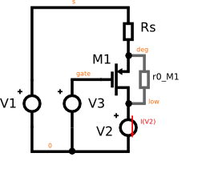
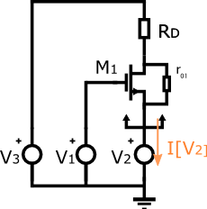
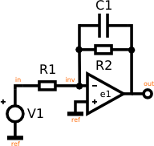

Symbolic examples
-----------------

Introduction
~~~~~~~~~~~~

A small signal symbolic analysis is requested through the ``.symbolic``
directive.

Its syntax is:

::

    .symbolic [tf=<source_name> ac=<bool> r0s=<bool>]

If the source is specified, all results are differentiated with respect
to the source value, to obtain transfer functions.

If ``ac`` is set to ``1``, ``True`` or ``yes``, capacitors and inductors
will be taken into account. If ``r0s`` is set to ``True`` or one of its
synonyms, the output resistances of the transistors will be considered.

.. seealso::

    The symbolic analysis section in :doc:`../help/Netlist-Syntax`,
    the module :mod:`ahkab.symbolic` and the helper function
    :func:`ahkab.ahkab.new_symbolic`.

Output resistance of a degenerated MOS transistor
~~~~~~~~~~~~~~~~~~~~~~~~~~~~~~~~~~~~~~~~~~~~~~~~~

Let's say we wish to check the expression of the output resistance of
the circuit in the figure above, the small signal :math:`-\mathrm{V_2/I[V_2]}`.

Save the following netlist to a file, in the following the name of this
file is assumed to be "rd.ckt".

::

    * Output resistance of a degenerated MOS transistor
    m1 low gate deg 0 pch w=1u l=1u
    rs deg s 1k
    v1 gate 0 type=vdc vdc=1
    v3 s 0 type=vdc vdc=1
    v2 low 0 type=vdc vdc=1

    .model ekv pch type=p kp=10e-6 vto=-1
    .symbolic tf=v2 r0s=1

Start ahkab with:

::

    ./ahkab rd.ckt

Results
^^^^^^^

::

    * OUTPUT RESISTANCE OF A DEGENERATED MOS TRANSISTOR
    Starting symbolic DC...
    Building symbolic MNA, N and x...  done.
    Building equations...
    Performing auxiliary simplification...
    Auxiliary simplification solved the problem.
    Success!
    [ ... very long lines omitted  ... ]
    Calculating small-signal symbolic transfer functions (v2))... done.
    Small-signal symbolic transfer functions:
    I_[V1]/v2 = 0
        DC: 0
    I_[V2]/v2 = -1.0/(R_s*gm_M1*r0_M1 + R_s + r0_M1)
        DC: -1.0/(R_s*gm_M1*r0_M1 + R_s + r0_M1)
    I_[V3]/v2 = 1.0/(R_s*gm_M1*r0_M1 + R_s + r0_M1)
        DC: 1.0/(R_s*gm_M1*r0_M1 + R_s + r0_M1)
    V_deg/v2 = 1.0*R_s/(R_s*gm_M1*r0_M1 + R_s + r0_M1)
        DC: 1.0*R_s/(R_s*gm_M1*r0_M1 + R_s + r0_M1)
    V_gate/v2 = 0
        DC: 0
    V_low/v2 = 1.00000000000000
        DC: 1.00000000000000
    V_s/v2 = 0
        DC: 0

The simulator solves the circuit symbolically and the differentiates the
results according to the transfer function requested.

We wish to know the transfer function between :math:`V_2` and :math:`-I[V_2]`,
rearranging the results above:

.. math::

    R_{out} = -\frac{dV_2}{dI[V_2]} = r_{0,\,M_1} + R_s + g_{m,\,M_1}r_{0,\,M_1}R_s

Resistance seen at the source of a transistor with a resistor at the drain
~~~~~~~~~~~~~~~~~~~~~~~~~~~~~~~~~~~~~~~~~~~~~~~~~~~~~~~~~~~~~~~~~~~~~~~~~~

Let's evaluate the symmetric circuit to the previous one: this time the
resistor is located at the drain (Rd) and we connect the test voltage
source at the transistor source node.

We wish to verify the famous result:

.. math::

    R_{out} = \frac{r_0 + R_D}{1 + g_mr_0}

Which evaluates to :math:`1/g_m` if:

-  :math:`g_mr_0 >> 1`,
-  :math:`r_0 >> R_D`.

The circuit we wish to simulate to extract the equivalent resistance is:

which can be described with the netlist:

::

    * Resistance seen at the source of a
    * transistor with a resistor at the drain
    m1 low gate deg 0 pch w=1u l=1u
    rd low s 1k
    v1 gate 0 type=vdc vdc=1
    v3 s 0 type=vdc vdc=2
    v2 deg 0 type=vdc vdc=1

    .model ekv pch type=p kp=10e-6 vto=-1
    .symbolic tf=v2 r0s=1

Running ``ahkab`` just like in the example before, we get:

::

    Starting symbolic AC analysis...
    Building symbolic MNA, N and x...  done.
    Building equations...
    Solving...
    Success!
    Results:
    I[V1]    = 0
    I[V2]    = (V1*gm_m1*r0_m1 - V2*gm_m1*r0_m1 - V2 + V3)/(RD*(1 + r0_m1/RD))
    I[V3]    = (-V1*gm_m1*r0_m1 + V2*(gm_m1*r0_m1 + 1) - V3)/(RD*(1 + r0_m1/RD))
    Vdeg     = V2
    Vgate    = V1
    Vlow     = (-V1*gm_m1*r0_m1 + V2*(gm_m1*r0_m1 + 1) + V3*r0_m1/RD)/(1 + r0_m1/RD)
    Vs   = V3
    Calculating small-signal symbolic transfer functions (V2))... done.
    Small-signal symbolic transfer functions:
    I[V1]/V2 = 0
        DC: 0
    I[V2]/V2 = (-gm_m1*r0_m1 - 1)/(RD + r0_m1)
        DC: (-gm_m1*r0_m1 - 1)/(RD + r0_m1)
    I[V3]/V2 = (gm_m1*r0_m1 + 1)/(RD + r0_m1)
        DC: (gm_m1*r0_m1 + 1)/(RD + r0_m1)
    Vdeg/V2 = 1
        DC: 1
    Vgate/V2 = 0
        DC: 0
    Vlow/V2 = RD*(gm_m1*r0_m1 + 1)/(RD + r0_m1)
        DC: RD*(gm_m1*r0_m1 + 1)/(RD + r0_m1)
    Vs/V2 = 0
        DC: 0

Where the transfer function  we are looking for is :math:`-V_2/I[V_2]`.

After rearranging, we get:

.. math::

    -\frac{dV_2}{dI[V_2]} = \frac{R_D + r_{0,\,M_1}}{g_{m,\,M_1}r_{0,\,M_1} + 1}

Just like it was expected.

Small-signal transfer function of various opamp configurations
~~~~~~~~~~~~~~~~~~~~~~~~~~~~~~~~~~~~~~~~~~~~~~~~~~~~~~~~~~~~~~

Integrator with finite gain
^^^^^^^^^^^^^^^^^^^^^^^^^^^

The ideal integrator is the configuration shown above with no :math:`R_2`
resistor. It has a transfer function equal to :math:`T(s) = K/s` for all
frequencies. Notice the infinite zero-frequency gain.

A real integrator will have a transfer function differing from the one
above because of many factors. One of which is the finite gain of every
amplifier. This goes well with the simulator as it does not like
"infinite quantities".

Netlist:

::

    PERFECT INTEGRATOR
    v1 in 0 type=vdc vdc=1
    r1 in inv 1k
    e1 out 0 0 inv 1e6
    c1 inv out 1p

    .symbolic tf=v1 ac=1

If the amplifier has a gain equal to :math:`e_1`, then, skipping to the results,
we get:

::

    I[E1]    = (C1*s*v1 + C1*e1*s*v1)/(1 + C1*R1*s + C1*R1*e1*s)
    I[V1]    = -(C1*s*v1 + C1*e1*s*v1)/(1 + C1*R1*s + C1*R1*e1*s)
    Vin  = v1
    Vinv     = v1/(1 + C1*R1*s + C1*R1*e1*s)
    Vout     = -e1*v1/(1 + C1*R1*s + C1*R1*e1*s)
    Calculating symbolic transfer functions (v1)... done!
    d/dv1 I[E1] = (C1*s + C1*e1*s)/(1 + C1*R1*s + C1*R1*e1*s)
        DC: 0
        P0: 1/(-C1*R1 - C1*R1*e1)
        Z0: 0
    d/dv1 I[V1] = -(C1*s + C1*e1*s)/(1 + C1*R1*s + C1*R1*e1*s)
        DC: 0
        P0: 1/(-C1*R1 - C1*R1*e1)
        Z0: 0
    d/dv1 Vin = 1
        DC: 1
    d/dv1 Vinv = 1/(1 + C1*R1*s + C1*R1*e1*s)
        DC: 1
        P0: 1/(-C1*R1 - C1*R1*e1)
    d/dv1 Vout = -e1/(1 + C1*R1*s + C1*R1*e1*s)
        DC: -e1
        P0: 1/(-C1*R1 - C1*R1*e1)

:math:`dV_{out}/dv_1` is what we are interested in, here: the DC gain increases
proportionally to :math:`e_1` and the position of the low frequency pole moves
back towards DC with :math:`e_1` increasing.

Leaky integrator with finite gain
^^^^^^^^^^^^^^^^^^^^^^^^^^^^^^^^^

If we introduce a resistor :math:`R_2` shunting the capacitor, we get a low
frequency amplifier, which approximately behaves like an amplifier with constant
gain :math:`-R_2/R_1` before :math:`\omega = -1/(C_1 R_2)`, then the gain
decreases by 20dB/decade.

Netlist:

::

    LEAKY INTEGRATOR WITH FINITE GAIN
    v1 in 0 type=vdc vdc=1
    r1 in inv 1k
    e1 out 0 0 inv 1e6
    c1 inv out 1p
    r2 inv out 1k

    .symbolic tf=v1 ac=1

From the simulation:

::

    I[E1]    = (v1 + e1*v1 + C1*R2*s*v1 + C1*R2*e1*s*v1)/(R1 + R2 + R1*e1 + C1*R1*R2*s + C1*R1*R2*e1*s)
    I[V1]    = (v1 + e1*v1 + C1*R2*s*v1 + C1*R2*e1*s*v1)/(-R1 - R2 - R1*e1 - C1*R1*R2*s - C1*R1*R2*e1*s)
    Vin  = v1
    Vinv     = R2*v1/(R1 + R2 + R1*e1 + C1*R1*R2*s + C1*R1*R2*e1*s)
    Vout     = R2*e1*v1/(-R1 - R2 - R1*e1 - C1*R1*R2*s - C1*R1*R2*e1*s)
    Calculating symbolic transfer functions (v1)... done!
    d/dv1 I[E1] = (1 + e1 + C1*R2*s + C1*R2*e1*s)/(R1 + R2 + R1*e1 + C1*R1*R2*s + C1*R1*R2*e1*s)
        DC: (1 + e1)/(R1 + R2 + R1*e1)
        P0: (R1 + R2 + R1*e1)/(-C1*R1*R2 - C1*R1*R2*e1)
        Z0: -1/(C1*R2)
    d/dv1 I[V1] = (1 + e1 + C1*R2*s + C1*R2*e1*s)/(-R1 - R2 - R1*e1 - C1*R1*R2*s - C1*R1*R2*e1*s)
        DC: (1 + e1)/(-R1 - R2 - R1*e1)
        P0: (R1 + R2 + R1*e1)/(-C1*R1*R2 - C1*R1*R2*e1)
        Z0: -1/(C1*R2)
    d/dv1 Vin = 1
        DC: 1
    d/dv1 Vinv = R2/(R1 + R2 + R1*e1 + C1*R1*R2*s + C1*R1*R2*e1*s)
        DC: R2/(R1 + R2 + R1*e1)
        P0: (R1 + R2 + R1*e1)/(-C1*R1*R2 - C1*R1*R2*e1)
    d/dv1 Vout = R2*e1/(-R1 - R2 - R1*e1 - C1*R1*R2*s - C1*R1*R2*e1*s)
        DC: R2*e1/(-R1 - R2 - R1*e1)
        P0: (R1 + R2 + R1*e1)/(-C1*R1*R2 - C1*R1*R2*e1)

If :math:`e_1` is indeed very high, the circuit results are as expected.

.. math::

    \frac{dV_{out}}{dV_1} \xrightarrow[e_1 \rightarrow +\infty] {} -\frac{R_2}{R_1}\frac{1}{1 + sC_1R_2}

Effects of finite output resistance, differential input capacitance,
finite input resistance can all be simulated similarly.
