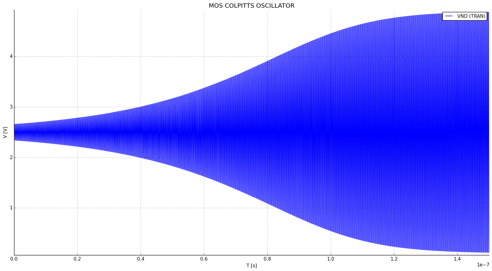
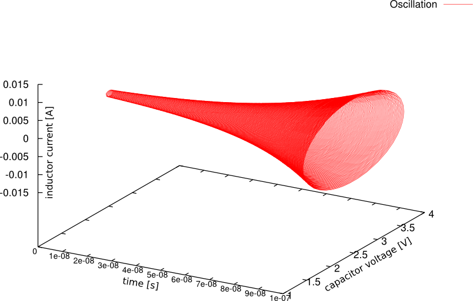

Transient simulation example
============================

Introduction
------------

This is an example of transient simulation, featuring the well-known `Colpitts oscillator <http://en.wikipedia.org/wiki/Colpitts_oscillator>`_.

.. image:: ../images/transient-example-1/colpitts.png

Bias:

:math:`V_{dd}=2.5V`, :math:`V_{bias}=2V`.

Passives:

:math:`L_1 = 5 nH`, :math:`R_0=3.14 k\Omega` (:math:`Q_L=33` @ 3 GHz)

:math:`C_1 = C_2 = 1.012 pF` (resulting in :math:`n = C_1/(C_1 + C_2) = 0.5`)

:math:`C_2` has a :math:`Q` greater than 10 for every :math:`I_b` less than
:math:`(w_0 C_2)^2/(2 K 10^2)` = 4.8 mA.

Under such condition, the minimum transconductance required for oscillation can
be calculated considering the MOS transistor an ideal voltage probe. The
presence of the MOS has to be taken into account when evaluating the overall
:math:`Q` of the tank.

Under such hypothesis: :math:`g_{m,min} = 1/(n(1-n)R0)`,
:math:`I_{b,min} = 1.27` mA. In the following we use :math:`I_b` = 1.3mA.

Netlist
-------

::

    MOS COLPITTS OSCILLATOR

    vdd dd 0 type=vdc vdc=2.5

    * Ql = 33 at 3GHz
    l1 dd nd 5n ic=-1n
    r0 nd dd 3.5k 

    * n = 0.5, f0 = 3GHz
    c1 nd ns 1.12p ic=2.5
    c2 ns 0  1.12p *ic=.01

    m1 nd1 bias ns ns nmos w=200u l=1u
    vtest nd nd1 type=vdc vdc=0 *read current

    * Bias
    vbias bias 0 type=vdc vdc=2
    ib ns 0 type=idc idc=1.3m

    .model ekv nmos TYPE=n VTO=.4 KP=10e-6

    .op
    .tran tstop=150n tstep=.1n method=trap uic=2
    .plot tran v(nd)

The voltage generator Vtest has been added to the circuit in series with M1's
drain to add the drain current to the variables.

We need to simulate the circuit for roughly :math:`T \approx 10Q_L/f_0` = 110ns
to approach the steady state solution. The simulation above stops at :math:`t`
= 150ns.

Running the simulation
----------------------

Save the netlist in a file and start ahkab with:

``$ ahkab colpitts_mos.spc -o colpitts_graph``

The simulation takes 70s on my laptop. Set ``tstop`` to a lower value to make it
faster.

Results
-------

Operating point (.OP)
~~~~~~~~~~~~~~~~~~~~~

The operating point is shown in this section of the program output:

::

    2015-02-23 15:28:37
    ahkab v. 0.13 (c) 2006-2015 Giuseppe Venturini

    Operating Point (OP) analysis

    Netlist: colpitts_mos.ckt
    Title: MOS colpitts oscillator
    At 300.00 K
    Options:
        vea = 1.000000e-06
        ver = 0.001000
        iea = 1.000000e-09
        ier = 0.001000
        gmin = 0.000000e+00

    Convergence reached in 42 iterations.

    ========
    RESULTS:
    ========

    Variable        Value         Error  (%)      Units
    ----------  ---------  ------------  -------  -------
    VDD          2.5       -2.5e-12      (-0.00)  V
    VND          2.5       -2.5e-12      (-0.00)  V
    VNS         -0.116201   2.48567e-10  (-0.00)  V
    VND1         2.5       -2.50951e-10  (-0.00)  V
    VBIAS        2         -2e-12        (-0.00)  V
    I(VDD)      -0.0013     0            (-0.00)  A
    I(L1)        0.0013     0            (0.00)   A
    I(VTEST)     0.0013     0            (0.00)   A
    I(VBIAS)     0          0            (0.00)   A

    ========================
    ELEMENTS OP INFORMATION:
    ========================

    Part ID      V(n1-n2) [V]         Q [C]        E [J]
    ---------  --------------  ------------  -----------
    C1               2.6162     2.93015e-12  3.83292e-12
    C2              -0.116201  -1.30145e-13  7.56149e-15

    Part ID      V(n1-n2) [V]    I [A]         P [W]
    ---------  --------------  -------  ------------
    IB              -0.116201   0.0013  -0.000151061

    Part ID      ϕ(n1,n2) [Wb]    I(n1->n2) [A]      E [J]
    ---------  ---------------  ---------------  ---------
    L1                 6.5e-12           0.0013  4.225e-15

    ----  --------  -----------------  ----  ----  -----------------  -----  --------  -------------------------  ----  --------  -----------------
    m1    N ch      STRONG INVERSION               LINEAR
    beta  [A/V^2]:  0.000746574470194  Weff  [m]:  0.0002 (0.0002)    Leff   [m]:      1.33945110625e-06 (1e-06)  M/N:            1/1
    Vdb   [V]:      2.616200987        Vgb   [V]:  2.116200987        Vsb    [V]:      0.0                        Vp    [V]:      1.18126783831
    VTH   [V]:      0.4                VOD   [V]:  1.61188671993      nq:              1.44011732737              VA    [V]:      1.99917064176
    Ids   [A]:      0.00129999988445   nv:         1.36453957998      Ispec  [A]:      3.84987888131e-06          TEF:            0.063129029685
    gmg   [S]:      0.00184989038878   gms   [S]:  -0.00317451824956  rob    [Ω]:      1537.82370727
    if:             475.729938341      ir:         23.4335578457      Qf     [C/m^2]:  0.00111108138735           Qr    [C/m^2]:  0.000227594358407
    ----  --------  -----------------  ----  ----  -----------------  -----  --------  -------------------------  ----  --------  -----------------

    Part ID      R [Ω]    V(n1,n2) [V]    I(n1->n2) [A]    P [W]
    ---------  -------  --------------  ---------------  -------
    R0            3500               0                0        0

    Part ID      V(n1,n2) [V]    I(n1->n2) [A]     P [W]
    ---------  --------------  ---------------  --------
    VDD                   2.5          -0.0013  -0.00325
    VTEST                 0             0.0013   0
    VBIAS                 2             0        0

Transient simulation (.TRAN)
~~~~~~~~~~~~~~~~~~~~~~~~~~~~

The oscillation builds up quickly, as shown in this plot of :math:`V_{nd}`:

From inspection, the circuit oscillates at 3.002 GHz with an oscillation
amplitude of roughly 4V.

The following graph is the drain current of the mos transistor. M1 is on only
for a fraction of each period, this happens if :math:`I_b` is greater than
approx. :math:`1.5I_{b,min}`.

It can be shown that an increase in :math:`I_b` increases the oscillation
amplitude. When The oscillation amplitude (at ``nd``) approaches :math:`V_{dd}`,
a damping will appear at the middle of the current peak, because
:math:`V_{ds} = V_{nd}` - :math:`V_{ns}` will be near to zero. If the
oscillation amplitude increases further :math:`V_{ds}` crosses 0V and becomes
negative for a small period of time.  Accordingly, :math:`I_d` crosses 0A and
becomes negative for such period. This does not happen in this case, but it can
be tested changing the neltist.

Of course, in any case, the average current through M1 has to be equal
to :math:`I_b`.

During a period, M1 is always on, switching from saturation region
(:math:`Vgs > Vt`, :math:`Vgd < Vt`) to ohmic operation (channel at both source and
drain). The latter happens when :math:`I_d` is maximum.

The next plot shows the oscillation starting off from the very beginning
in a phase plane:

