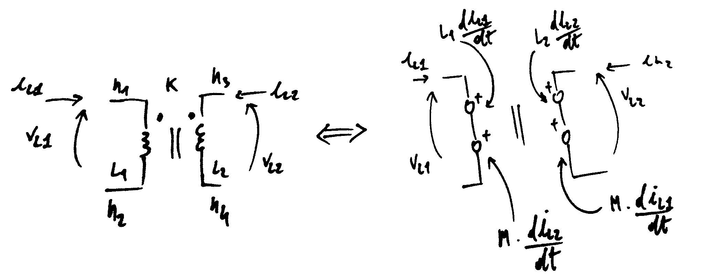
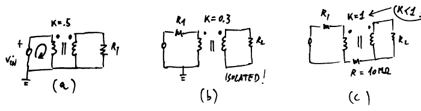
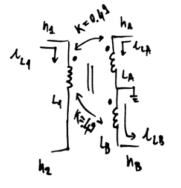

Mutual Inductors
----------------

Introduction
============

This page explains briefly how to use coupling between inductors.

If you are familiar with SPICE's mutual inductors, you can skip this
page, they work the same way.

Netlist syntax
==============

::

    K<string> <inductor1> <inductor2> <float>

or::

    K<string> <inductor1> <inductor2> k=<float>

API syntax
==========

If you have a circuit instance ``my_circuit`` containing two inductors with IDs
``'LP'`` and ``'LS'``, you can add a coupling of value 0.89 between them with::

    my_circuit.add_inductor_coupling(part_id='K1', L1='LP', L2='LS', value=.89)

For further information, refer to
:func:`ahkab.circuit.Circuit.add_inductor_coupling`.

Usage and internal modeling
===========================

The coupling between two inductors is defined by the two inductors to be coupled
and the value coupling factor :math:`k`. *The coupling factor has to be lesser
than one.*

*Dot convention:* for every inductor coupling, the dot is to be placed
on the first node specified when the inductor was declared.

Eg. the left hand side of the figure above can be specified with the
entries below:

::

    L1 n1 n2 1u
    L2 n3 n4 1u
    K1 L1 L2 k=.2

Internally, the following equations are enforced (refer to the right
hand side of the previous figure):

.. math::
    V_{L1} = L_1 \frac{dI(L_1)}{dt} + M \frac{dI(L_2)}{dt} \\
    V_{L2} = L_2 \frac{dI(L_2)}{dt} + M \frac{dI(L_1)}{dt} \\

Where :math:`M` is the *mutual inductance* and it is defined as:

.. math::
    M = K \sqrt{L_1 L_2}

Ideal transformers
==================

Ideal (perfect) transformers are not supported, but can be approximated
with the following choices:

- Set :math:`k=0.999` (an ideal transformer would have :math:`k=1`),
- Set the inductors values high enough that the primary and secondary
  inductances have a negligible effect on the current/voltages over the
  transformer. (an ideal tranformer would have "infinite" primary and
  secondary inductances),
- Set the ratio of the primary/secondary inductances :math:`L_1/L_2` equal to
  the windings ratio :math:`n_1/n_2`.

Pathological circuits
=====================

A few pathological circuits are shown in the next figure.

**Explanations:**

**(a)** is pathological because two elements are specifying the transformer
input node at the same time (think what would happen in real life...). The
resulting MNA matrix is singular.

- insert a series resistor to break the loop.

**(b)** corrects the issue above, but has an isolated secondary, which means
that all the voltages at the secondary winding are not unequivocally defined.
The resulting MNA is singular. 

- join the primary and secondary with a very high isolation resistor or set the
  voltage of one node at the secondary with a voltage source.

**(c)** has :math:`k=1`. :math:`k` has to be less than 1 or *instability
ensues*.

Multiple coupling
=================

It is possible to couple multiple inductors together, the following is
an example of a transformer with a center tap (connected to ground in
this case).

::

    * Transformer with a grounded center tap: 
    * Primary: n1, n2
    * Secondary 1: nA, 0
    * Secondary 2: 0, nB

    L1 n1 n2 10u
    LA nA 0 5u
    LB 0 nB 5u
    K1 L1 LA .49
    K1 L1 LB .49

Known limitations
=================

-  For the time being mutual inductors are unsupported in subcircuits.
-  The inductors *have to be declared first.*
