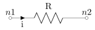
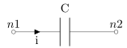
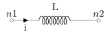
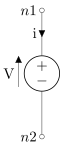
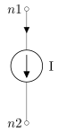
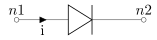
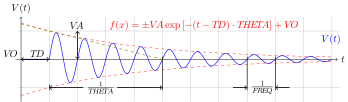
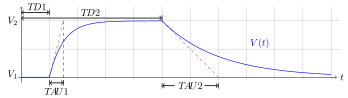
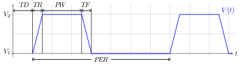

.. raw:: html

Netlist Syntax
~~~~~~~~~~~~~~

This document describes the syntax to be used to describe a circuit and
its relative analyses.

.. contents:: Table of Contents

The netlist file
""""""""""""""""

Circuits are described in text files called *netlists* (or sometimes
'decks').

Each line in a netlist file falls in one of these categories: 

    * The title.
    * A element declaration.
    * A analysis declaration.
    * A directive declaration (eg. ``.ic`` or ``.end``). 
    * A comment. Comments start with ``*``. 
    * A continuation line. Continuation lines start with ``+``. 
    * Blank line (ignored).

Title
"""""

The title is a special type of comment and it is **always the first line
in the file**. *Do not put any other directive here.*

Elements
""""""""

In general, an element is declared with the following general syntax:

``<K><description_string> <n1> <n2> [value] [<option>=<value>] [...] ...``

Where:

* ``<K>`` is a character, a unique identifier for each type of
  element (e.g. R for resistor)
* ``<description_string>`` is a string without spaces (e.g ``1``)
* ``<n1>``, a string, is the the node of the circuit
  to which the anode of the element is connected.
* ``<n2>``, a string, is the node of the circuit to which the cathode of
  the element is connected.
* ``[value]`` if supported, is the 'value' of the element, in mks
  (e.g. R1 1 0 500k)
* ``<option>=<value>`` are the parameters of the element

Nodes may have any label, without spaces, except the *reference* *node*
which has to be ``0``.

Linear elements
^^^^^^^^^^^^^^^

Resistors
'''''''''



**General syntax:**

``R<string> n1 n2 <value>``

-  ``n1`` and ``n2`` are the element nodes.
-  ``value`` is the element resistance. It may any non-zero value
   (negative values are supported too).

**Example:**

::

    R1 1 0 1k
    RAb_ input output 1.2e6

Capacitors
''''''''''



**General syntax:**

``C<string> n1 n2 <value> [ic=<value>]``

-  ``n1`` and ``n2`` are the element nodes.
-  ``value`` is the capacitance in Farads.
-  ``ic=<value>`` is an optional attribute that can be set to provide an
   initial value voltage value for a transient simulation.
   See also the discussion of the ``UIC`` parameter in TRAN simulations.

**Example:**

::

    C1 1 0 1u
    Cfeedback out+ in- 1e6

Inductors
'''''''''



**General syntax:**

``L<string> n1 n2 <value> [ic=<float>]``

-  ``n1`` and ``n2`` are the element nodes.
-  ``value`` is the inductance in Henry.
-  ``ic=<value>`` is an optional attribute that can be set to provide an
   initial value for a transient simulation. See also the discussion of
   the ``UIC`` parameter in TRAN simulations.

**Example:**

::

    L1 1 0 1u
    Lchoke inA inB 1e6

Mutual Inductors
''''''''''''''''


**General syntax:**

Either:

``K<string> <inductor1> <inductor2> <value>``

or

``K<string> <inductor1> <inductor2> k=<value>``

-  ``<inductor1>`` and ``<inductor2>`` are the coupled inductors. They
   need to be specified before the coupling can be inserted.
-  ``value`` is the coupling factor, ``k``. It is a needs to be less
   than 1.

**Example:**

::

    L1 1 0 1u
    L2 3 4 5u
    K1 L1 L2 0.6

Voltage-controlled switch
'''''''''''''''''''''''''

.. image:: ../images/elem/switch.svg

**General syntax:**

``S<string> n1 n2 ns1 ns2 <model_id>``

-  ``n1`` and ``n2`` are the nodes corresponding to the output port,
   where the switch opens and closes the connection.
-  ``ns1`` and ``ns2`` are the nodes corresponding to the driving port,
   where the voltage setting the switch status is read.
-  ``model_id`` is the model describing the switch operation. Notice
   that even if an ideal switch is a (piece-wise) linear element, its
   model implementation may not be, depending on the implementation
   details of the transition region.

Independent sources
^^^^^^^^^^^^^^^^^^^

Voltage source
''''''''''''''



**General syntax:**

``v<string> n1 n2 [type=vdc vdc=float] [type=vac vac=float] [type=....]``

Where the third type (if added) is one of: 

Current source
''''''''''''''



**General syntax:**

``i<string> n1 n2 [type=idc idc=float] [type=iac iac=float] [type=....]``

The declaration of the time variant part is the same as stated above for
voltage sources, except that ``vo`` becomes ``io``, ``va`` becomes
``ia`` and so on.

Dependent sources
^^^^^^^^^^^^^^^^^

Voltage-Controlled Voltage Source (VCVS)
''''''''''''''''''''''''''''''''''''''''


**General syntax:**

``E<string> n+ n- ns+ ns- <value>``

-  ``n+`` and ``n-`` are the nodes corresponding to the output port,
   where the voltage is forced.
-  ``ns+`` and ``ns-`` are the nodes corresponding to the driving port,
   where the voltage is read.
-  ``value`` is the proportionality factor, ie:
   ``V(n+) - V(n-) = value*[V(sn+) - V(sn-)]``.

Voltage-Controlled Current Source (VCCS)
''''''''''''''''''''''''''''''''''''''''


**General syntax:**

``G<string> n+ n- ns+ ns- <value>``

-  ``n+`` and ``n-`` are the nodes corresponding to the output port,
   where the current is forced.
-  ``ns+`` and ``ns-`` are the nodes corresponding to the driving port,
   where the voltage is read.
-  ``value`` is the proportionality factor, ie:
   ``I(n+,n-) = value*[V(sn+) - V(sn-)]``.

Non-linear elements
^^^^^^^^^^^^^^^^^^^

The simulator has a few non-linear components built-in. Others may
easily be added as external modules.

Diode 
'''''



**General syntax:**

``D<string> N+ N- <model_id> [<AREA=float> <T=float> <IC=float> <OFF=boolean>]``

MOS Transistors
'''''''''''''''


**General syntax:**

``M<string> nd ng ns nb <model_id> w=<float> l=<float>``

A MOS device declaration requires:

* ``nd``: the drain node,
* ``ng``: the gate node,
* ``ns``: the source node,
* ``nb``: the bulk node 

* ``<model_id>``: is a string that links this device to a ``.model``
  declaration in the netlist. The model is actually responsible of the
  operation of the device. 

* ``w``: gate width, in meters
* ``l``: gate length, in meters.

User-defined elements
'''''''''''''''''''''

**General syntax:**

``Y<X> <n1> <n2> module=<module_name> type=<type> [<param1>=<value1> ...]``

Ahkab can parse user-defined elements. In order for this to work, you
should write a Python module that supplies the element class. The
simulator will attempt to load the module ``<module_name>`` and it will
then look for a class named ``<type>`` within.

See :func:`netlist_parser.parse_elem_user_defined` for further
information.

Subcircuit calls
^^^^^^^^^^^^^^^^

**General syntax:**

``X<string> name=<subckt_label> [<subckt_node1>=<node_a> <subckt_node2>=<node_b> ... ]``

Insert a subcircuit, connected as specified.

All nodes in the subcircuit specification must be connected to a circuit
node. The call can be placed before or after the corresponding .subckt
directive.

Time functions
""""""""""""""

Time functions may be used in conjuction with an independent source
to define its time-dependent behaviour.

This is typically done adding a ``type=...`` section in the element decalration,
such as:

::

    V1 1 2 vdc=10m type=sin VO=10m VA=1.2 FREQ=500k TD=1n THETA=0


Sinusoidal waveform
^^^^^^^^^^^^^^^^^^^

A damped sinusoidal time function.



It may be described with the syntax:

::

    type=sin <VO> <VA> <FREQ> <TD> <THETA> <PHASE>


or with the more verbose variant:

::

    type=sin VO=<float> VA=<float> FREQ=<float> TD=<float> THETA=<float> PHASE=<float>


Mathematically described by:

* When :math:`t < td`:

.. math::

    V(t) = V\!O

* When :math:`t \ge td`:

.. math::

    V(t) = V\!O + V\!A \cdot \mathrm{exp}[-{T\!H\!E\!T\!A} \cdot (t - T\!D)] \cdot \mathrm{sin}[2 \pi F\!R\!E\!Q (t - T\!D) + (P\!H\!A\!S\!E/360)]

Where:

* :math:`V\!O` is the offset voltage in Volt.
* :math:`V\!A` is the amplitude in Volt.
* :math:`F\!R\!E\!Q` is the frequency in Hertz.
* :math:`T\!D` is the delay in seconds.
* :math:`T\!H\!E\!T\!A` is the damping factor per second.
* :math:`P\!H\!A\!S\!E` is the phase in degrees.

Exponential source
^^^^^^^^^^^^^^^^^^



An exponential waveform may be described with one of the following syntaxes:

::

     type=EXP <V1> <V2> <TD1> <TAU1> [<TD2> <TAU2>]
::

    type=exp v1=<float> v2=float td1=float tau1=<float> td2=<float> tau2=<float> 


Example:

::

     VIN input 0 type=vdc vdc=0 type=exp 4 1 2n 30n 60n 40n


Mathematically, it is described by the equations:

* :math:`0 \le t < TD1`:

.. math::

    f(t) = V1

* :math:`TD1 < t < TD2`

.. math::

    f(t) = V1+(V2-V1) \cdot \left[1-\exp \left(-\frac{t-TD1}{TAU1}\right)\right]

* :math: t > TD2

.. math::

    f(t) = V1+(V2-V1) \cdot \left[1-\exp \left(-\frac{t-TD1}{TAU1}\right)\right]+(V1-V2) \cdot \left[1-\exp \left(-\frac{t-TD2}{TAU2}\right)\right]

**Parameters:**

=========  ==================  =============  =======
Parameter  Meaning             Default value  Units
=========  ==================  =============  =======
V1         initial value                      V or A
V2         pulsed value	                      V or A
TD1        rise delay time     0.0            s
TAU1       rise time constant                 s
TD2        fall delay time     Infinity       s
TAU2       fall time constant  Infinity       s
=========  ==================  =============  =======


Pulsed source 
^^^^^^^^^^^^^

A square wave.



::

    type=pulse v1=<float> v2=<float> td=<float> tr=<float> tf=<float> pw=<float> per=<float>


Device models
"""""""""""""

Rudimentary EKV 3.0 MOS model
^^^^^^^^^^^^^^^^^^^^^^^^^^^^^

**General syntax:**

``.model ekv <model_id> TYPE=<n/p> [TNOM=<float> COX=<float> GAMMA=<float> NSUB=<float> PHI=<float> VTO=<float> KP=<float> TOX=<float> VFB=<float> U0=<float> TCV=<float> BEX=<float>]``

The EKV model was developed by Matthias Bucher, Christophe Lallement,
Christian Enz, Fabien Théodoloz, François Krummenacher at the
Electronics Laboratories, Swiss Federal Institute of Technology (EPFL),
Lausanne, Switzerland.

It is described here: 

- rev. 2.6 - http://legwww.epfl.ch/ekv/pdf/ekv\_v262.pdf
- rev. 3.0 - http://www.nsti.org/publications/MSM/2002/pdf/346.pdf

The authors are in no way responsible for any bug that may be
present in my implementation. :)

The model is missing:

- channel length modulation,
- complex mobility reduction, 
- RSCE transcapacitances, 
- the quasistatic modeling.

It does identify weak, moderate and strong inversion zones, it is fully
symmetrical, it treats N and P devices equally.

Square-law MOS model
^^^^^^^^^^^^^^^^^^^^

**General syntax:**

``.model mosq <model_id> TYPE=<n/p> [TNOM=<float> COX=<float> GAMMA=<float> NSUB=<float> PHI=<float> VTO=<float> KP=<float> TOX=<float> VFB=<float> U0=<float> TCV=<float> BEX=<float>]``

This is a square-law MOS model without velocity saturation (and second
order effects like punch-through and such).

DIODE model
^^^^^^^^^^^

**General syntax:**

``.model diode <model_id> [IS=<float> N=<float> ISR=<float> NR=<float> RS=<float> CJ0=<float> M=<float> VJ=<float> FC=<float> CP=<float> TT=<float> BV=<float> IBV=<float> KF=<float> AF=<float> FFE=<float> TEMP=<float> XTI=<float> EG=<float> TBV=<float> TRS=<float> TTT1=<float> TTT2=<float> TM1=<float> TM2=<float>]``

The diode model implements the `Shockley diode
equation <http://en.wikipedia.org/wiki/Shockley_diode_equation#Shockley_diode_equation>`__.
Currently the capacitance modeling part is missing.

The most important parameters are:

+---------------+-------------------+-----------------------------------+
| *Parameter*   | *Default value*   | *Description*                     |
+===============+===================+===================================+
| IS            | 1e-14 A           | Specific current                  |
+---------------+-------------------+-----------------------------------+
| N             | 1.0               | Emission coefficient              |
+---------------+-------------------+-----------------------------------+
| ISR           | 0.0 A             | Recombination current             |
+---------------+-------------------+-----------------------------------+
| NR            | 2.0               | Recombination coefficient         |
+---------------+-------------------+-----------------------------------+
| RS            | 0.0 ohm           | Series resistance per unit area   |
+---------------+-------------------+-----------------------------------+

please refer to the SPICE documentation and the ``diode.py`` file for
the others.

TANH(x)-shaped switch model
^^^^^^^^^^^^^^^^^^^^^^^^^^^

**General syntax:**

There are two possible syntax:

``.model SW <model_id> VT=<float> VH=<float> RON=<float> ROFF=<float>``

``.model SW <model_id> VON=<float> VOFF=<float> RON=<float> ROFF=<float>``

This model implements a voltage-controlled switch where the transition
is modeled with tanh(x).

Hysteresis is supported through the parameter ``VH``. When set, the two
thresholds become ``VT+VH`` and ``VT-VH`` (distance ``2*VH``!).

When ``VON`` and ``VOFF`` are specified instead of ``VT`` and ``VH``,
the latter two are set from the former according to the relationships:

-  ``VT = (VON-VOFF)/2 + VOFF``
-  ``VH = 1e-3*VT``

**Parameters and default values:**

+---------------+-------------------+------------------------+--------------------+
| *Parameter*   | *Default value*   | *Description*          | *Restrictions*     |
+===============+===================+========================+====================+
| VT            | 0 V               | Threshold voltage      |                    |
+---------------+-------------------+------------------------+--------------------+
| VH            | 0 V               | Hysteresis voltage     | Must be positive   |
+---------------+-------------------+------------------------+--------------------+
| RON           | 1 ohm             | ON-state resistance    | Must be non-zero   |
+---------------+-------------------+------------------------+--------------------+
| ROFF          | 1/gmin            | OFF-state resistance   | Must be non-zero   |
+---------------+-------------------+------------------------+--------------------+

Analyses
""""""""

Operating point (OP)
^^^^^^^^^^^^^^^^^^^^

**General syntax:**

``.op [guess=<ic_label>]``

This analysis tries to find a DC solution through a pseudo Newthon
Rahpson (NR) iteration method. Notice that a non-linear circuit may have
zero, a discrete number or infinite OPs.

Which one is found depends on the circuit and on the initial guess
supplied to the method. The program has a built in method that tries to
generate a "smart" initial guess to speed up convergence. When that
fails, or is disabled from command line (see --help), the initial guess
is set to all zeros.

The user may supply a better guess, if known. This can be done adding a
.ic directive somewhere in the netlist file and setting
``guess=<ic_label>`` where ``<ic_label>`` matches the .ic's
``name=<ic_label>``.

The ``t = 0`` value is automatically added as dc value to every
time-variant independent source without a explicit dc value.

DC sweep
^^^^^^^^

**General syntax:**

``.DC src=<src_name> start=<float> stop=<float> step=<float> type=<linear/log>``

Performs a DC sweep (repeated OP analysis with the value of a voltage or
current source changing at every iteration).

Parameters: 

- ``src``: the id of the source to be swept (V12, Ibias...).
    Only independent current and voltage sources.

- ``start`` and ``stop``: sweep start and stop values.

- type: either ``linear`` or ``log``

- step: sets the value of the source from an iteration :math:`(k)` to the next :math:`(k+1)`: 

   - if ``type=log``, :math:`S(k+1) = S(k) \cdot step`

   - if ``type=linear``, :math:`S(k+1) = S(k) + step`

Transient analysis
^^^^^^^^^^^^^^^^^^

**General syntax:**

``.TRAN TSTEP=<float> TSTOP=<float> [TSTART=<float>  UIC=0/1/2/3 [IC_LABEL=<string>] METHOD=<string>]``

Performs a transient analysis from tstart (which defaults to 0) to
tstop, using the step provided as initial step and the method specified
(if any, otherwise defaults to implicit\_euler).

Parameters:

-  ``tstart``: the starting point, defaults to zero.
-  ``tstep``: this is the initial step. By default, the program will try
   to adjust it to keep the estimate error within bounds.
-  ``tstop``: Stop time.
-  ``UIC`` (Use Initial Conditions): This is used to specify the state
   of the circuit at time ``t = tstart``. Available values are ``0``,
   ``1``, ``2`` or ``3``.
-  ``uic=0``: all node voltages and currents through v/h/e/sources will
   be assumed to be zero at ``t = tstart``
-  ``uic=1``: the status at \`t = tstart is the last result from a OP
   analysis.
-  ``uic=2``: the status at t=tstart is the last result from a OP
   analysis on which are set the values of currents through inductors
   and voltages on capacitors specified in their ic. This is done very
   roughly, checking is recommended.
-  ``uic=3``: Load a user supplied ic. This requires a ``.ic`` directive
   somewhere in the netlist and a ``.ic``'s name and ``ic_label`` must
   match.
-  method: the integration method to be used in transient analysis.
   Built-in methods are: ``implicit_euler``, ``trap``, ``gear2``,
   ``gear3``, ``gear4``, ``gear5`` and ``gear6``. Defaults to ``trap``.
   May be overridden by the value specified on the command line with the
   option: ``-t METHOD`` or ``--tran-method=METHOD``.

High order methods are slower per iteration, but they often can afford a
longer step with comparable error, hence they are actually faster in
many cases.

If a transient analysis stops because of a step size too small, use a
low order method (ie/trap) and set ``--t-max-nr`` to a high value (eg
1000).

AC
^^

**General syntax:**

``.AC start=<float> stop=<float> nsteps=<integer>``

Performs an AC analysis.

If the circuit is non-linear, a successful Operating Point (OP) is
needed to linearize the circuit.

The sweep type is by default (and currently unchangeable) logarithmic.

Parameters: \* start: the starting *angular* *frequency* of the sweep.
\* stop: the final angular frequency \* nsteps: the number of steps to
be executed

Periodic Steady State (PSS)
^^^^^^^^^^^^^^^^^^^^^^^^^^^

``.PSS period=<float> [points=<int> step=<float> method=<string> autonomous=<bool>]``

This analysis tries to find the periodic steady state (PSS) solution of
the circuit.

Parameters: 

- ``period``: the period of the solution. To be specified only
  in not autonomous circuits (which are somehow clocked). 
- ``points``: How many time points to use to discretize the solution. If ``step`` is set, this
  is automatically computed.
- ``step``: Time step on the period. If ``points`` is set, this is
  automatically computed. 
- ``method``: the PSS algorithm to be employed. Options are: ``shooting`` 
  (default) and ``brute-force``.
- ``autonomous``: self-explanatory boolean. If set to ``True``, currently the
  simulator halts, because autonomous circuits are not supported, yet.

Pole-Zero analysis (PZ)
^^^^^^^^^^^^^^^^^^^^^^^

The PZ analysis computes the poles (and optionally the zeros) of a circuit.

It can be specified with any of the following equivalent syntaxes:

```.PZ [OUTPUT=<V(node1,node2)> SOURCE=<string> ZEROS=<bool> SHIFT=<float>]```

or

```.PZ [V(<node1>,<node2>) <SOURCE> <ZEROS=1> <SHIFT=0>]```

Internally, it is implemented through the modification-decomposition
(MD) method, which is based on finding the eigenvalues of the 
Time Constant Matrix (TCM).

All the following parameters are optional and only needed for zero calculation.

Parameters:

- ``output``: the circuit output voltage, in the form of ``<V(node1,node2)>``.
  Notice the lack of space in between nodes and comma.
- ``source``: the ``part_id`` of the input source.
- ``zeros``: boolean, calculate the zeros as well. If ``output`` and ``source``
  are set, then this is automatically set to 1 (true).
- ``shift`` initial frequency shift for calculation of the singularities. Optional.
  In a network that has zeros in the origin, this may be set to some non-zero
  value since the beginning.

Symbolic small-signal and transfer function
^^^^^^^^^^^^^^^^^^^^^^^^^^^^^^^^^^^^^^^^^^^

``.symbolic [tf=<source_name> ac=bool]``

-  tf: If the source is specified, all results are differentiated with
   respect to the source value (transfer functions).
-  ac: If set to True, capacitors and inductors will be included.
   Defaults to False.

Performs a small-signal analysis of the circuit, optionally including AC
elements (slows down the solution). In the results, the imaginary unit
is shown as ``I``, the angular frequency as ``w``.

Results are printed to stdout.

We rely on the sympy library for symbolic computations. The library is
under development and might have trouble (or take a long time) with
medium-big netlists. Improvements are on their way.

Other directives
""""""""""""""""

End
^^^

``.end``

Force the parser to stop reading the netlist. Everything after this line
is disregarded.

Ends
^^^^

``.ends``

Closes a subcircuit block.

Ic
^^

Set an Initial Condition for circuit analysis.

``.ic name=<ic_label> [v(<node>)=<value> i(<element_name>)=<value> ... ]``

This allows the specification of a state of a circuit. Every node
voltage or current (through appropriate elements) may be specified. If
not set, it will be set to ``0``. Notice that setting an inappropriate or
inconsistent IC will create convergence problems.

**Example:**

::

    .ic name=oscillate1 V(1)=10 V(nOUT)=2 I(VTEST)=5m

To use an IC directive in a transient analysis, set '``UIC=3``' and
'``IC_LABEL=<ic_label>``'.

Include
^^^^^^^

``.include <filename>``

Include a file. It's equivalent to copy & paste the contents of the file
to the bottom of the netlist.

Subckt
^^^^^^

``.subckt <subckt_label> [node1 node2 ... ]``

Subcircuits are netlist block that may be called anywhere in the circuit
using a subckt call. They can have other subckt calls within - but
beware of recursively calling the same subcircuit!

They can hold other directives, but the placement of the directive
doesn't change its meaning (ie if you add a .op line in the subcircuit
or outside of it it's the same).

They can't be nested and have to be ended by a ``.ends`` directive.

Plot
^^^^

``.plot <simulation_type> [variable1 variable2 ... ]``

Parameters: 

- ``simulation_type``: which simulation will have the data
plotted. Currently the available options are ``tran``, ``shooting`` and ``dc``. 

- ``variable1``, ``variable2``: the signals to be plotted.

They may be:

- a voltage, syntax ``V(<node>)``, to plot the voltage at the specified node,
    or ``V(<node2>, <node1>)``, to plot the difference of the node
    voltages. Eg ``V(in)`` or ``V(2,1)``. 
- a current, syntax ``I(<source name>)``, eg. ``I(V2)`` or ``I(Vsupply)``
